# Aito Predictive ERP Demo

> ### 🚀 **[Live demo coming soon]**
> Watch a procurement-to-pay workflow drive itself: PO coding, approver
> routing, anomaly detection, demand forecast, inventory replenishment
> — all from a single transaction table, no model training.

[Aito.ai](https://aito.ai) is a predictive database that returns predictions,
recommendations, and statistics through SQL-like queries — no separate
training step, no retraining schedule, no MLOps.

This demo is a working open-source reference showing **14 production-ready
ERP features** built on Aito's `_predict`, `_relate`, `_search`, and
`_match` operators. Each view comes with a hero screenshot, working
code, and a use-case guide. The demo runs in three industry profiles —
**Metsä Machinery** (industrial maintenance), **Aurora Retail**
(commerce), **Helsinki Studio** (services) — each backed by its own
Aito DB, swap profiles in the TopBar.

[](LICENSE)
[](https://aito.ai)
[](tests/)
[](data/)

[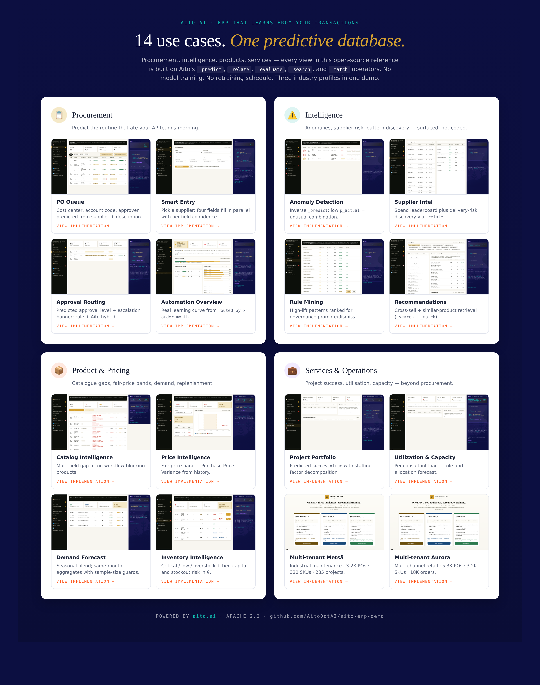](assets/teaser.html)

---

## Try it now

```bash
# Predict the cost center for a Lindström workwear PO — live, no signup
curl -X POST https://shared.aito.ai/db/aito-erp-demo/api/v1/_predict \
  -H "X-API-Key: <free-tier-key>" \
  -H "Content-Type: application/json" \
  -d '{
    "from": "purchases",
    "where": { "supplier": "Lindström Oy", "description": "Workwear order" },
    "predict": "cost_center",
    "select": ["$p", "feature", { "$why": {} }]
  }'
```

Response in ~30 ms: `Production` at 91.2% with the full `$why`
decomposition (base rate, pattern matches with token highlighting,
multiplicative chain).

---

## The end-to-end workflow loop

Smart Entry submits → PO Queue picks it up → Approval Routing predicts the approver → Inventory reorder creates the next one. Every override trains the next prediction.

| 1. Submit | 2. Appears in queue |
|-----------|---------------------|
| 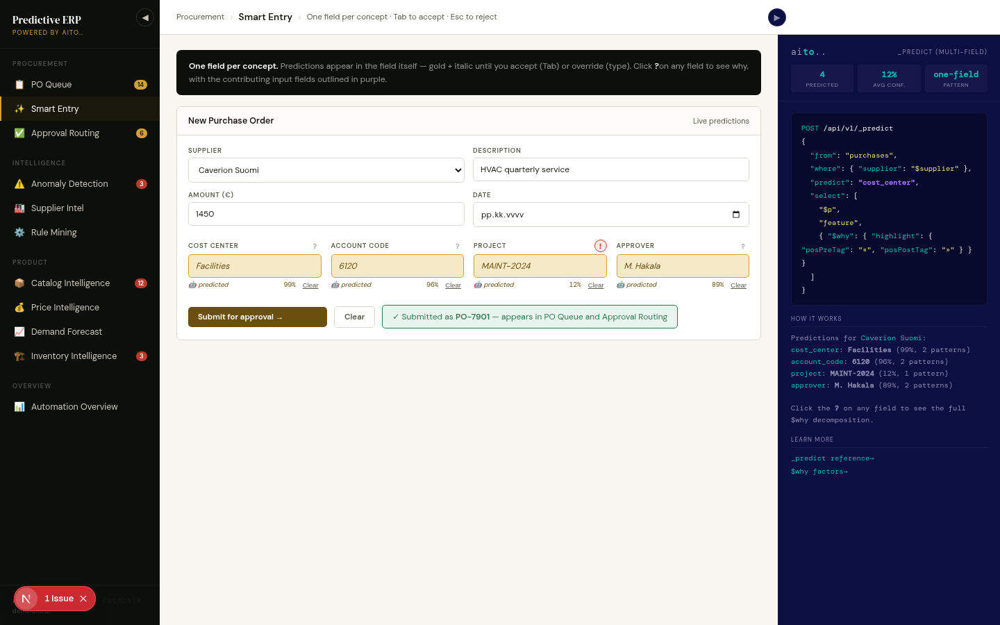 | 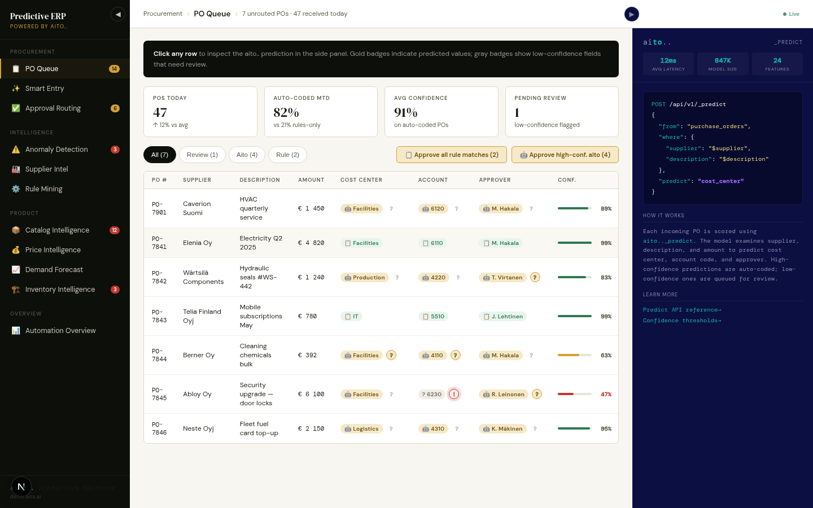 |

That's the whole demo in two screenshots: pick a supplier, four fields predict, click submit, watch it route. No retraining between steps.

---

## What's inside

### 1. 📋 PO Queue — Predicted account, cost center, approver
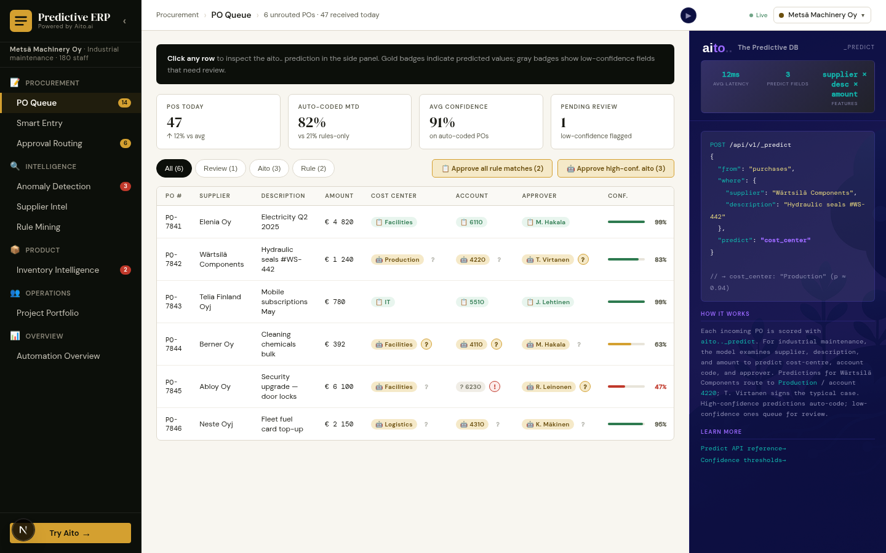
```json
{
  "from": "purchases",
  "where": {
    "supplier": "Wärtsilä Components",
    "description": "Hydraulic seals #WS-442"
  },
  "predict": "cost_center",
  "select": ["$p", "feature", { "$why": { "highlight": { "posPreTag": "«", "posPostTag": "»" } } }]
}
```
Hybrid rules + Aito routing with confidence-tier visualization. Bulk
approve all rule-matched rows in one click.
[→ Implementation](src/po_service.py) | [Use case guide](docs/use-cases/01-po-queue.md)

### 2. ✨ Smart Entry — Multi-field prediction with cross-highlight
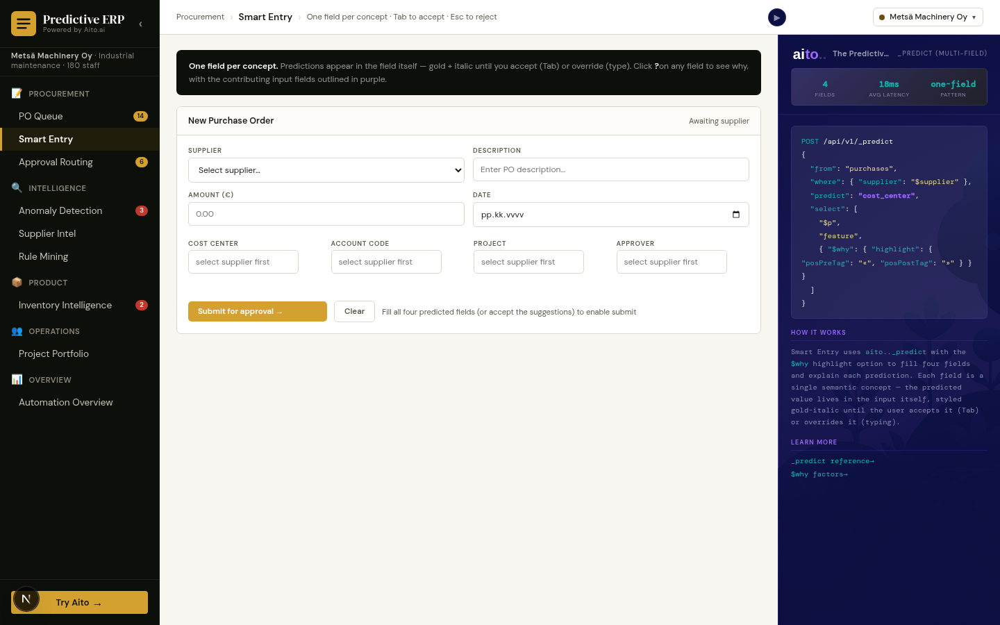
```json
// 4 fields predicted in parallel from a single supplier pick
{ "from": "purchases", "where": { "supplier": "Lindström Oy" }, "predict": "cost_center", "select": ["$p", "feature", "$why"] }
{ "from": "purchases", "where": { "supplier": "Lindström Oy" }, "predict": "account_code", "select": ["$p", "feature", "$why"] }
{ "from": "purchases", "where": { "supplier": "Lindström Oy" }, "predict": "project",     "select": ["$p", "feature", "$why"] }
{ "from": "purchases", "where": { "supplier": "Lindström Oy" }, "predict": "approver",    "select": ["$p", "feature", "$why"] }
```
One field per concept, three visual states (empty / predicted / user).
Tab to accept, Esc to reject. Click `?` on any field to see why — and
contributing input fields highlight in purple.
[→ Implementation](src/smartentry_service.py) | [Use case guide](docs/use-cases/02-smart-entry.md)

### 3. ✅ Approval Routing — Suggestions for governance review
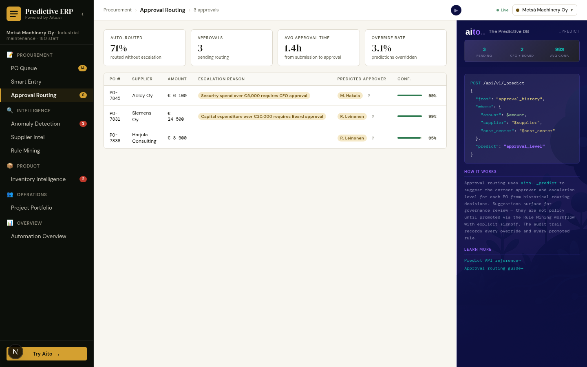
```json
{
  "from": "purchases",
  "where": { "supplier": "Abloy Oy", "category": "security", "amount_eur": { "$gt": 5000 } },
  "predict": "approver",
  "select": ["$p", "feature", "$why"]
}
```
Aito surfaces patterns like "amount > €5K + security → CFO" as
candidates; nothing becomes policy without explicit signoff via Rule
Mining.
[→ Implementation](src/approval_service.py) | [Use case guide](docs/use-cases/03-approval-routing.md)

### 4. ⚠️ Anomaly Detection — Inverse prediction
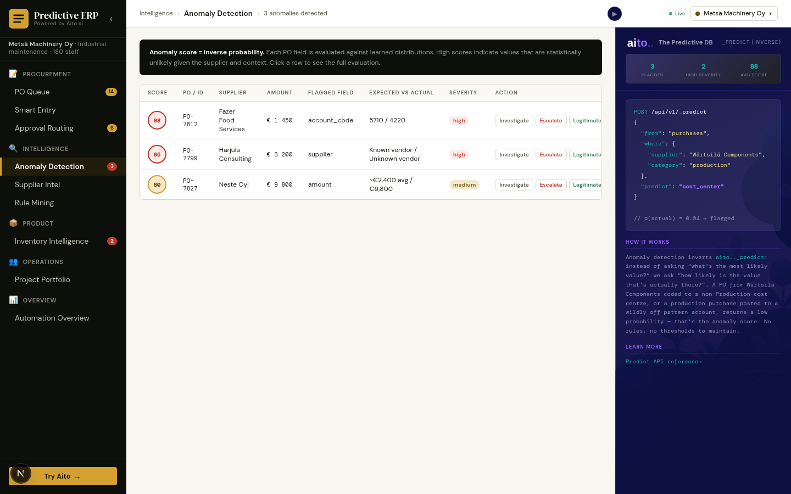
```json
{
  "from": "purchases",
  "where": { "supplier": "Fazer Food Services" },
  "predict": "account_code"
}
// Score = (1 - p_actual) × 100. Fazer × 4220 → 91 (never seen in 800+ records)
```
Three anomaly types: amount-spike, unknown-vendor, mis-coded-account.
Action buttons (Investigate / Escalate / Legitimate) close the loop.
[→ Implementation](src/anomaly_service.py) | [Use case guide](docs/use-cases/04-anomaly-detection.md)

### 5. 🏭 Supplier Intel — Risk discovery via _relate
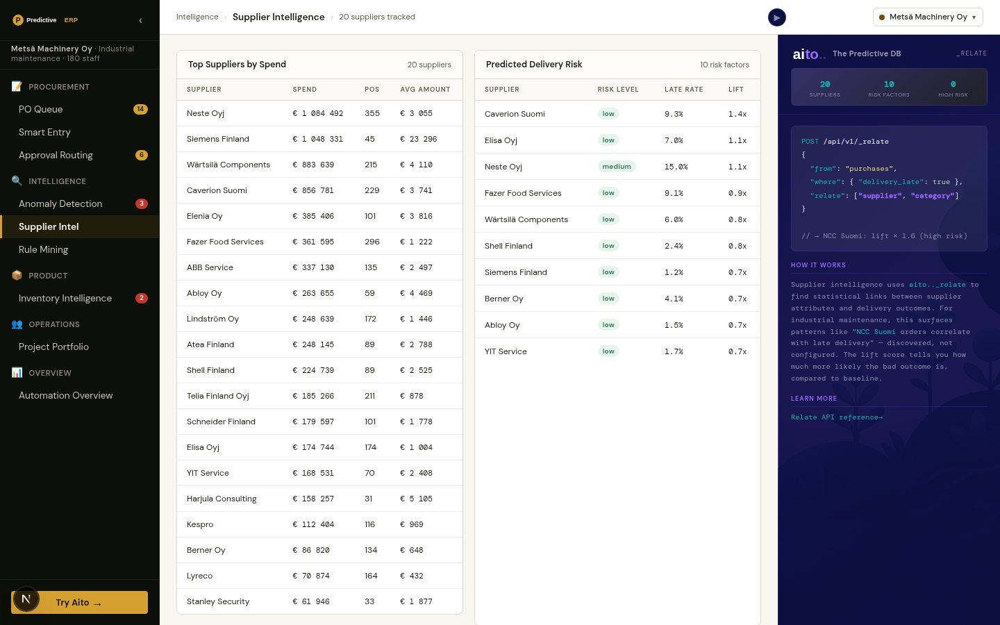
```json
{
  "from": "purchases",
  "where": { "delivery_late": true },
  "relate": "supplier"
}
// Returns: Neste Q4 lift 1.4× (33% late rate), Elenia winter lift 2.6×
```
Spend leaderboard plus delivery-risk discovery. Click any risk for
the lift breakdown.
[→ Implementation](src/supplier_service.py) | [Use case guide](docs/use-cases/05-supplier-intel.md)

### 6. ⚙️ Rule Mining — Candidates for governance review
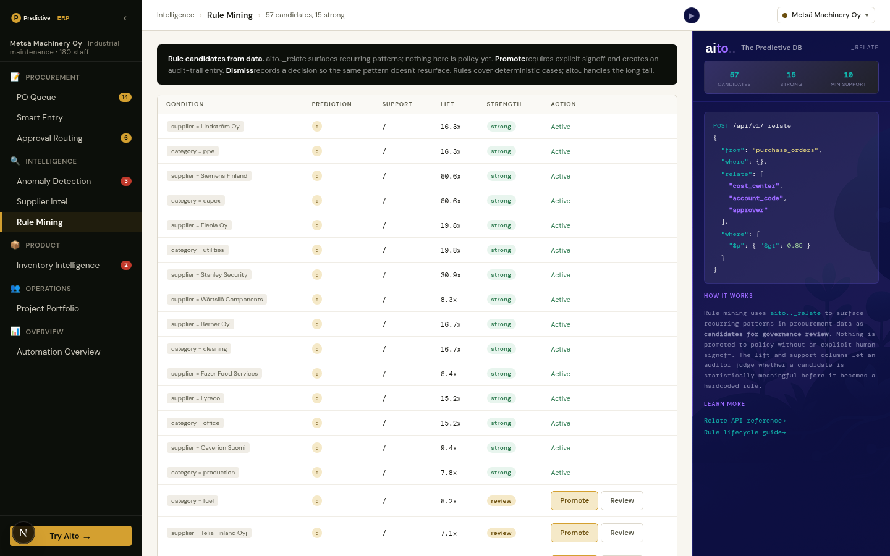
```json
{
  "from": "purchases",
  "relate": "cost_center",
  "select": ["lift", "ps.pOnCondition", "fs.fOnCondition", "fs.f"]
}
// Returns: "category=telecom → IT, lift 5.1×, 100% support over 17 cases"
```
Promote with explicit signoff (audit trail), Dismiss to record the
decision so the same pattern doesn't resurface.
[→ Implementation](src/rulemining_service.py) | [Use case guide](docs/use-cases/06-rule-mining.md)

### 7. 📦 Catalog Intelligence — Multi-field gap-filling
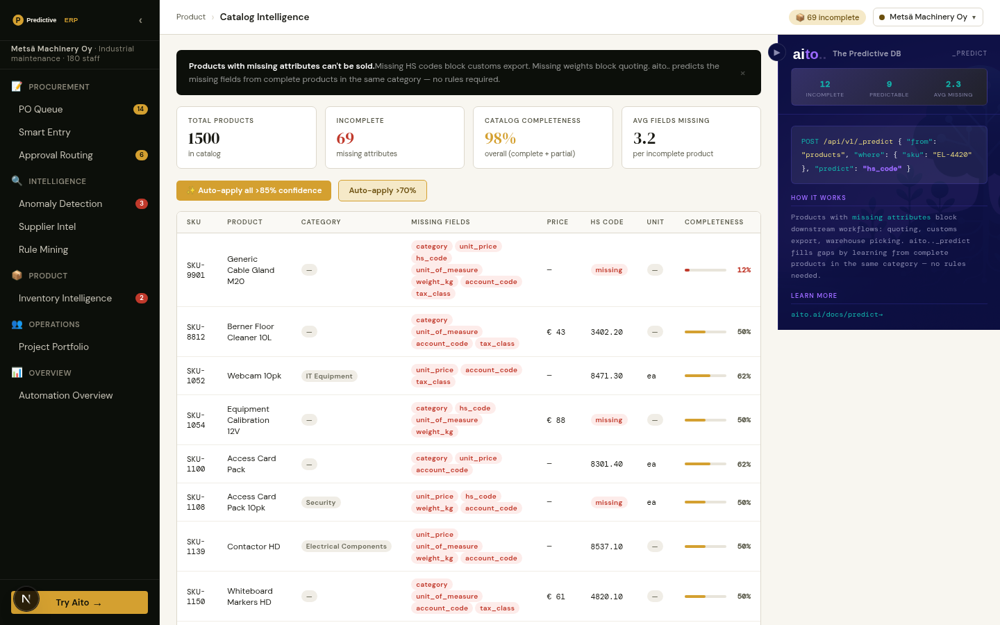
```json
// For each missing predictable field on a product:
{ "from": "products", "where": { "name": "Cable Gland M20" }, "predict": "category" }
{ "from": "products", "where": { "name": "Cable Gland M20" }, "predict": "hs_code"  }
{ "from": "products", "where": { "name": "Cable Gland M20" }, "predict": "unit_price" }
```
69 workflow-blocking products out of 1,500. One-click bulk apply for
high-confidence predictions across the whole catalog.
[→ Implementation](src/catalog_service.py) | [Use case guide](docs/use-cases/07-catalog-intelligence.md)

### 8. 💰 Price Intelligence — Fair-price band + PPV
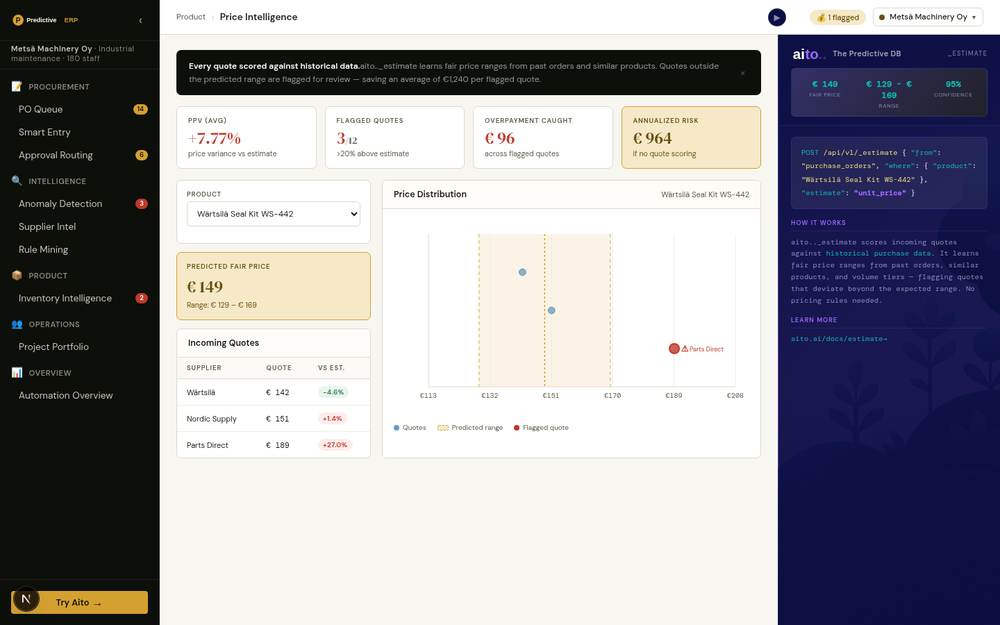
```json
{
  "from": "price_history",
  "where": { "product_id": "SKU-4421", "supplier": "Wärtsilä" },
  "limit": 100
}
// Aggregate client-side: mean, std, range; flag quotes > 20% above estimate
```
Fair-price range, flagged outliers (Parts Direct +28.9%), Purchase
Price Variance (PPV) with annualized exposure.
[→ Implementation](src/pricing_service.py) | [Use case guide](docs/use-cases/08-price-intelligence.md)

### 9. 📈 Demand Forecast — Seasonal patterns from order history
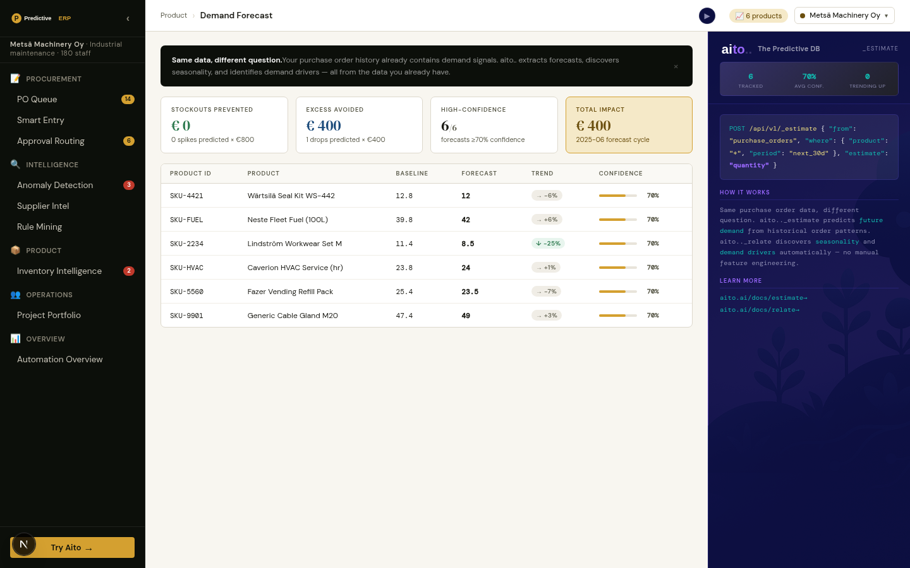
```json
{
  "from": "orders",
  "where": { "product_id": "SKU-2234", "month": "2025-08" },
  "predict": "units_sold"
}
// Plus seasonal aggregate: workwear August 2.3×, fuel July 0.65×, maintenance March/Sept 1.7×
```
Forecasts blend Aito's prediction with seasonality factors derived from
same-month historical data. Stockouts-prevented and excess-avoided
metrics in € per cycle.
[→ Implementation](src/demand_service.py) | [Use case guide](docs/use-cases/09-demand-forecast.md)

### 10. 🏗️ Inventory Intelligence — Stockout risk with cash impact
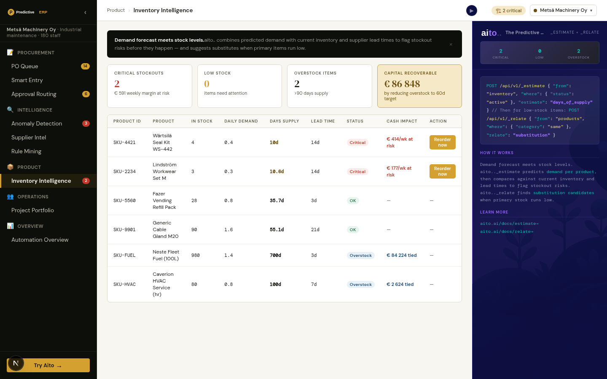
```python
# days_of_supply = stock / daily_demand
# critical if days_of_supply < lead_time + safety_buffer
# tied_capital = max(0, stock - daily_demand × 60) × unit_price
```
Critical / Low / OK / Overstock with €€€ tied capital and weekly
margin at risk per row. "Reorder now" creates a real PO that flows to
PO Queue and Approval.
[→ Implementation](src/inventory_service.py) | [Use case guide](docs/use-cases/10-inventory-intelligence.md)

### 11. 🗂 Project Portfolio — Predicted project success + staffing simulator

```json
{
  "from": "projects",
  "where": {
    "project_type": "implementation",
    "manager": "J. Lehtinen",
    "team_members": "A. Lindgren K. Saari M. Salo",
    "budget_eur": 120000,
    "duration_days": 90
  },
  "predict": "success"
}
```
Two patterns combined: `_predict success=true` per active project (with
`$why` factor decomposition showing manager fit, team mix, budget×duration
risk), and `_relate` over `assignments.person` to surface individuals
whose presence boosts or drags outcomes. Staffing simulator: swap a
team member, see P(success) move.
[→ Implementation](src/project_service.py) | [Use case guide](docs/use-cases/12-project-portfolio.md)

### 12. 👥 Utilization & Capacity *(Studio-only)* — Per-consultant load + role forecast
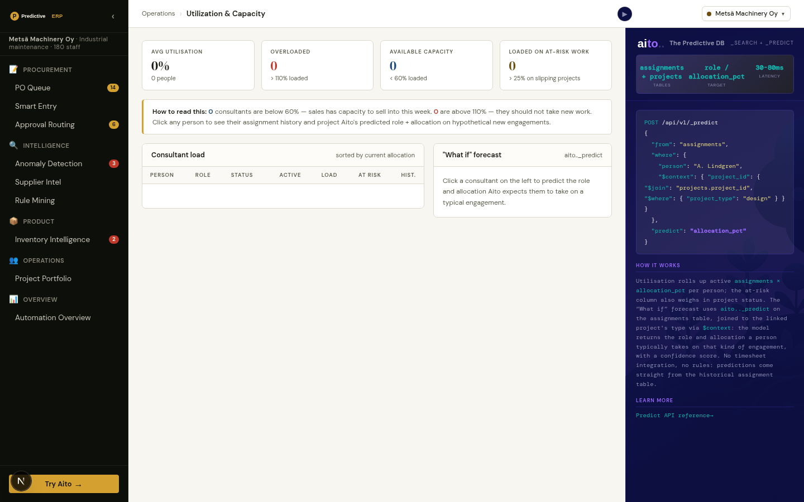
```json
{
  "from": "assignments",
  "where": { "person": "A. Lindgren", "project_type": "design" },
  "predict": "allocation_pct"
}
```
Aggregates active `assignments × allocation_pct` per consultant; flags
overloaded (>110%), available (<60%), and at-risk (>25% on slipping
work). The "what if" forecast is a plain single-table `_predict` —
`project_type` is denormalised onto each assignment row at load time —
returning the role + allocation that person typically takes on
engagements of that kind.
[→ Implementation](src/utilization_service.py) | [Use case guide](docs/use-cases/13-utilization.md)

### 13. 🛍 Recommendations *(Aurora-only)* — Cross-sell + similar products
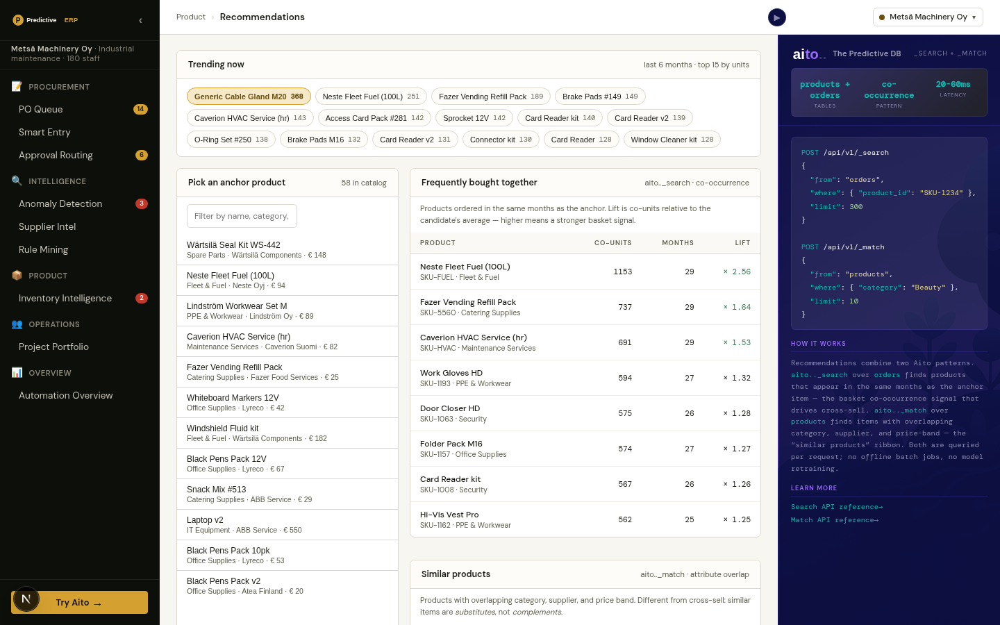
```json
// Cross-sell via month co-occurrence
{ "from": "orders", "where": { "product_id": "SKU-1234" }, "limit": 300 }

// Similar products via attribute overlap
{ "from": "products", "where": { "category": "Beauty" }, "match": "name", "limit": 10 }
```
Pick an anchor product → see "frequently bought together" (basket
co-occurrence with lift) and "similar products" (substitutes via
category × supplier × price-band match). Recursive browsing — click
any result to make it the new anchor.
[→ Implementation](src/recommendation_service.py) | [Use case guide](docs/use-cases/14-recommendations.md)

### 14. 📊 Automation Overview — Real learning curve
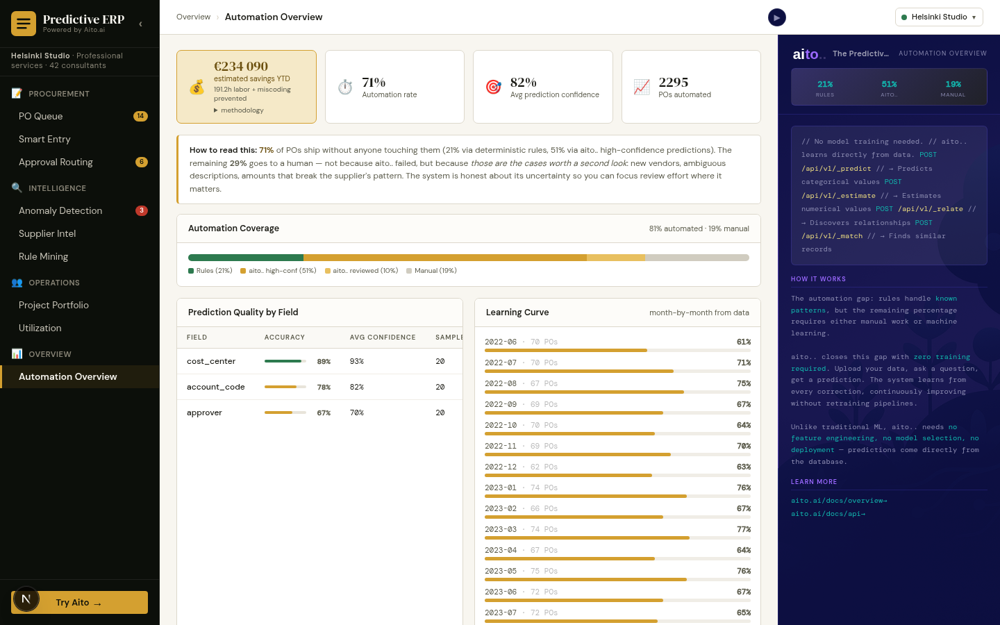
```json
{ "from": "purchases", "limit": 5000 }
// Group client-side by order_month × routed_by; filter months with N ≥ 5
```
**€220K savings YTD** with collapsible methodology footnote (labor +
miscoding-prevented). 29-month learning curve computed live from
`routed_by × order_month`.
[→ Implementation](src/overview_service.py) | [Use case guide](docs/use-cases/11-automation-overview.md)

---

## Multi-tenant: one demo, three audiences

The same code drives three industry profiles, each with its own Aito DB
and persona-appropriate fixtures. Switch in the TopBar (`localStorage.demoTenant`).

| Profile | Audience | Data shape |
|---------|----------|------------|
| **Metsä Machinery Oy** | Industrial maintenance / construction (Lemonsoft-shaped buyer) | Wärtsilä, ABB, Caverion, NCC · 3.2K POs · 320 spare-part SKUs · 285 maintenance/construction projects · 46 months of history |
| **Aurora Retail Oy** | Multi-channel retail (Oscar / ERPly-shaped buyer) | Valio, Marimekko, L'Oréal · 5.3K POs · 3.2K SKUs · 18K orders · 6.5K price points |
| **Helsinki Studio** | Professional services (horizontal SaaS buyer) | Adobe, AWS, Figma · 3.2K POs · 435 client engagements · 2.1K assignments |

Each profile filters which views appear in the side nav. The right-rail
Aito panel re-tones with persona-specific examples: Metsä's panel
quotes Wärtsilä → account 4220; Aurora's quotes Valio → account 4010;
Studio's quotes Adobe → account 5530.

```bash
# Generate per-tenant fixtures + load each into its own Aito DB
./do generate-personas
./do load-data --tenant=all
```

---

## Three signature interaction patterns

The demo's UX is built on three small, reusable components. Anyone
porting this to another vertical should keep them.

### `PredictionExplanation` — the $why renderer
Pure component that turns Aito's `$why` factor tree into:
1. Prediction value + confidence bar
2. Base rate (`baseP`)
3. Top 3-5 pattern matches with **token-level highlighting** from the
   `highlight` payload
4. The multiplicative chain `baseP × lift₁ × lift₂ × … = finalP`
5. Top 2-3 alternatives, clickable to override

[→ Component source](frontend/components/prediction/PredictionExplanation.tsx)

### `WhyPopover` — confidence-aware ledger annotation
Pattern C from the [prediction-explanations guide](https://aito.ai/docs/guides/prediction-explanations):
a `?` / `!` button anchored to a row that opens a popover. Visual
prominence scales inversely with confidence — faint at ≥85%, gold at
50-85%, **pulsing red `!` at <50%**.

[→ Component source](frontend/components/prediction/WhyPopover.tsx)

### `SmartField` — three-state input following the smart-forms guide
Single DOM input that's the same field whether the value came from a
prediction or the user. Three visual states: **empty** / **predicted**
(gold-italic with 🤖 badge) / **user** (normal). Tab promotes,
Esc rejects, typing replaces. Cross-highlights contributing input
fields when its popover is open.

[→ Component source](frontend/components/prediction/SmartField.tsx)

These match the patterns described in
[Smart Forms](https://aito.ai/docs/guides/smart-forms) and
[Prediction Explanations](https://aito.ai/docs/guides/prediction-explanations).

---

## Quick start

<details>
<summary>Click to expand installation instructions</summary>

```bash
# Clone and configure
git clone <repo-url>
cd aito-erp-demo
cp .env.example .env       # Edit AITO_API_URL, AITO_API_KEY

# Install (Python via uv, frontend via npm)
./do setup

# Generate ~12K records of fixture data (deterministic, ~2 sec)
python3 data/generate_fixtures.py

# Upload to Aito (~1 min for ~12K records)
./do load-data

# Start both servers (frontend on :8400, backend on :8401)
./do dev
# Open http://localhost:8400
```

The Next.js frontend on `:8400` proxies `/api/*` to FastAPI on `:8401` —
same origin, no CORS. Both hot-reload. Ctrl+C kills both.

</details>

## 🎯 Technical highlights

**Performance**: 12 K records, <100 ms `_predict` latency, 30 s cache warmup
**Schema**: 4 linked Aito tables (purchases, products, orders, price_history)
**Real signal**: 24 months of history, supplier/season/category patterns visible
**Architecture**: Next.js 16 (App Router) + FastAPI + Aito REST. Single-port dev.
**Tests**: 26 pytest tests (httpx-mocked); TypeScript strict mode

### Data scale

| Table | Rows | Period | Why this size |
|-------|------|--------|---------------|
| `purchases` | 2 819 | 24 months × ~120/mo | Realistic SMB monthly volume; stable per-supplier predictions |
| `products` | 1 500 | catalog snapshot | Mid-size SKU range; ~5% workflow-incomplete |
| `orders` | 5 092 | 29 months × top 200 SKUs | Enough to expose seasonality |
| `price_history` | 2 913 | 24 months × top SKUs × 3 suppliers | Multiple quotes per product |

Mock data is **internally consistent across views** and **deterministic**
(`random.seed(42)`). Regenerate any time with `python3 data/generate_fixtures.py`.

### Aito operators used

| Operator | What it does | Used in |
|----------|-------------|---------|
| `_predict` | Predict a field value from context | PO Queue, Smart Entry, Approval, Anomalies, Catalog, Demand |
| `_relate` | Discover statistical patterns with support and lift | Supplier Intel, Rule Mining |
| `_search` | Retrieve records | Aggregate metrics, learning curve, PPV, inventory |

### Project structure

```
├── frontend/                          # Next.js 16 (App Router, TS strict)
│   ├── app/                           # 11 view pages
│   ├── components/
│   │   ├── shell/                     # Nav, TopBar, AitoPanel, ErrorState
│   │   └── prediction/                # SmartField, WhyPopover,
│   │                                  #  PredictionExplanation, HighlightedText
│   └── lib/                           # api.ts, types.ts (full WhyExplanation type)
├── src/                               # FastAPI backend
│   ├── app.py                         # All endpoints
│   ├── aito_client.py                 # Thin Aito REST wrapper
│   ├── why_processor.py               # $why → frontend payload
│   ├── *_service.py                   # One module per business capability
│   ├── submission_store.py            # Workflow-loop state
│   ├── cache.py                       # 2-layer cache (memory + Aito table)
│   └── data_loader.py                 # Schema + batch upload
├── data/
│   ├── generate_fixtures.py           # Deterministic SMB-scale generator
│   └── *.json                         # Generated fixtures (gitignored)
├── tests/                             # 26 pytest tests
├── docs/
│   ├── use-cases/                     # 11 use-case guides (one per view)
│   ├── adr/                           # Architecture Decision Records
│   ├── aito-cheatsheet.md             # Verified Aito query patterns
│   └── demo-script.md                 # 11-scene walkthrough
├── screenshots/                       # ./do screenshot all
├── do                                 # Task runner
└── pyproject.toml                     # Python deps (uv)
```

## What this demo intentionally does NOT show

This is a **predictive-database reference**, not a complete ERP. The
table below is the same list of objections that lands in every CTO
walkthrough — owning the gaps is more credible than papering over them.

| Out of scope | Why it's missing | What you'd add for production |
|--------------|------------------|-------------------------------|
| **Three-way matching** (PO ↔ GRN ↔ invoice) | Demo stops at PO routing | Goods-receipt + matching service tied to AP |
| **GL period control** | Predicted accounts don't check whether the period is open | Period-status table; gate posting on `period_open=true` and re-route to the next open period when a prediction lands in a locked month |
| **Multi-country chart of accounts** | Single Finnish CoA hardcoded into fixtures | Per-customer `chart_of_accounts` mapping table; predictions return account_code in the source CoA, then the integration layer remaps to the destination tenant's accounts |
| **Segregation of duties** | Same demo user creates, codes, and approves | Role-based access tied to your IDP; the prediction call is a *suggestion* — actual posting is gated on the user's role |
| **Multi-entity / multi-currency** | All EUR, single legal entity | `entity_id` column on every table, FX rates in a side table, same multi-tenant routing pattern shown in the [accounting demo](https://github.com/AitoDotAI/aito-accounting-demo) |
| **Audit trail** | Override events aren't persisted across restarts | Persist to `prediction_log` table — `(prediction_id, user, accepted, overridden_to, $why_snapshot, ts)` |
| **Schema evolution** | Adding a column means regenerate + reload | Aito accepts column additions in place — see [data-upload-guide.md](docs/data-upload-guide.md) |
| **Multi-worker cache coherence** | 2-layer cache assumes single FastAPI worker | Aito-side persistent layer as source of truth (see [scaling.md](docs/scaling.md)) |
| **High-volume p99 latency** | Single-user warm-cache measurements | Load test with concurrent users — the predict-cache hit path is sub-ms but cold-cache `_predict` round-trips are ~30-100ms |
| **e-Invoice / verkkolasku / ALV** | Finnish formats aren't generated | Wire to Maventa / Apix / similar — predictions feed the line-item coding *before* the invoice gets serialized |
| **Aito hosting cost at scale** | Demo uses three small DBs on shared.aito.ai | Pricing tiers depend on row count + QPS — ask Aito sales. The architecture (one DB per tenant) holds at 1K tenants; at 10K+ tenants you'll want pooled DBs sharded by tenant cohort. See [scaling.md](docs/scaling.md) |

Each row is a real objection raised by ERP-SaaS CTOs evaluating the
demo. If yours isn't on the list, [open an issue](../../issues) and we
will add it.

## 🚀 Available commands

```bash
# Data
python3 data/generate_fixtures.py     # Regenerate fixtures (deterministic)
./do load-data                        # Upload to Aito
./do reset-data                       # Drop and reload

# Development
./do dev                              # Both servers (frontend :8400 + backend :8401)
./do stop / restart                   # Kill / restart servers
./do clear-cache                      # Invalidate prediction cache

# Quality
./do test                             # 26 pytest tests
./do typecheck                        # TypeScript strict check
./do screenshot all                   # Refresh all 11 view screenshots

# Demo
./do demo                             # Open in browser
```

## 📖 Deep dive

- **[Use Case Guides](docs/use-cases/)** — Per-feature implementation guides with code, schema, and tradeoffs (14 views)
- **[Data Model](docs/data-model.md)** — Six tables, what each predicts, how the links work
- **[Data Upload Guide](docs/data-upload-guide.md)** — Single-tenant + multi-tenant setup recipes
- **[Security](docs/security.md)** — Threat model + the `PUBLIC_DEMO=1` lockdown bundle
- **[Demo Script](docs/demo-script.md)** — Walkthrough for live presentations
- **[Aito Cheatsheet](docs/aito-cheatsheet.md)** — Verified query patterns
- **[Architecture Decisions](docs/adr/)** — Why we chose what we did
- **[Smart Forms guide](https://aito.ai/docs/guides/smart-forms)** — The pattern behind SmartField
- **[Prediction Explanations guide](https://aito.ai/docs/guides/prediction-explanations)** — The pattern behind WhyPopover

## 🤝 Why this matters

Procurement automation traditionally meant: write a routing rule, write
a coding rule, write an approval rule, write an anomaly rule. Maintain
them. Watch them rot. Hire people to clean up the 70% that doesn't fit.

Aito flips it: **load your transactions, query for predictions, promote
patterns to rules with governance**. No retraining, no MLOps, no
feature engineering. The data is the model.

This demo proves it on a real procurement workload — Finnish supplier
names, realistic descriptions, 24 months of history, all the messiness
that makes ERP hard.

**Traditional procurement automation**: Rules everywhere → Maintenance burden → 21% ceiling
**With Aito**: 21% rules + 51% predictions + 28% honestly flagged for review → 72% real automation ✅

## Companion demos

- [aito-demo](https://github.com/AitoDotAI/aito-demo) — E-commerce reference (recommendations, search, autofill)
- [aito-accounting-demo](https://github.com/AitoDotAI/aito-accounting-demo) — Multi-tenant AP automation (256 customers, ~250K invoices)

---

*Apache 2.0 licensed. Open issues, send PRs, fork into your own ERP vertical.*
