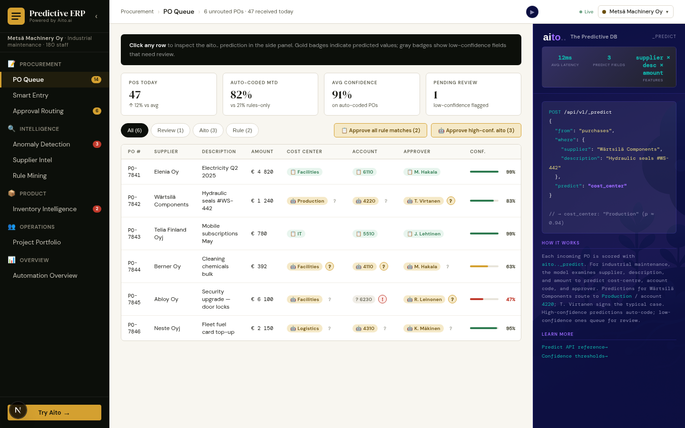

# PO Queue — Predicted account, cost center, approver



*Pending POs auto-coded with confidence scores; rule matches in green, Aito predictions in gold, low-confidence rows flagged for review*

## Overview

Every purchase order arriving in the queue needs three decisions: which
**cost center** owns it, which **GL account code** receives the
expense, and which **approver** signs off. In a traditional ERP, those
decisions are either coded into rule tables (which rot) or made
manually (which is slow). Aito treats them as predictions from the
purchase history.

The PO Queue runs three `_predict` calls per row — cost_center,
account_code, approver — and renders each prediction with confidence
visualization and a `?` button that opens the full `$why` decomposition.

## How it works

### Traditional vs. AI-powered PO routing

**Traditional:**
- Hand-coded rules per supplier ("Telia → IT/5510")
- Manual lookup for new suppliers
- Approval-threshold rules drift as policy changes
- 21% automation ceiling typical for rule-only systems

**With Aito:**
- Rules cover what a supplier's history bears out — Elenia → account
  6110 (right on 140 of 145 POs), Telia → 5510 and approver J. Lehtinen —
  and show that count instead of a flat 99%
- Aito `_predict` covers the long tail — every supplier with history
- `$why` shows exactly why each prediction was made
- 70%+ realistic auto-coding ceiling on real SMB data

### Implementation

The PO service in `src/po_service.py` asks Aito for all three fields,
then lets a supplier rule override only the fields it measurably decides:

```python
def predict_single(client: AitoClient, invoice: dict, tenant: str | None = None) -> POPrediction:
    where = {"supplier": invoice["supplier"]}
    if invoice.get("description"):
        where["description"] = invoice["description"]

    cc_result = client.predict("purchases", where, "cost_center", limit=10)
    ac_result = client.predict("purchases", where, "account_code", limit=10)
    ap_result = client.predict("purchases", where, "approver", limit=10)
    prediction = POPrediction(...)          # top hit, $p, $why and alternatives per field

    # A rule sets only the fields its supplier's history bears out at
    # RULE_MIN_PRECISION (0.90), at the precision measured — never a flat 0.99.
    rule = next((r for r in rules_for(tenant) if r["supplier"] == invoice["supplier"]), None)
    if rule is not None:
        for field_name, (value, right, of) in measure_rule(client, rule).items():
            setattr(prediction, field_name, value)
            setattr(prediction, f"{field_name}_confidence", round(right / of, 3))
            prediction.rule_fields[field_name] = f"rule {rule['name']}: right on {right} of {of} POs"

    # The weakest field decides, for rule rows and Aito rows alike.
    prediction.confidence = min(prediction.cost_center_confidence,
                                prediction.account_code_confidence,
                                prediction.approver_confidence)
    ...
```

The `_predict` query shape:

```json
{
  "from": "purchases",
  "where": {
    "supplier": "Wärtsilä Components",
    "description": "Hydraulic seals #WS-442"
  },
  "predict": "cost_center",
  "select": [
    "$p",
    "feature",
    {
      "$why": {
        "highlight": { "posPreTag": "«", "posPostTag": "»" }
      }
    }
  ],
  "limit": 10
}
```

The sentinel tags `«` / `»` let the frontend split and render highlights
as `<mark>` elements without `dangerouslySetInnerHTML`.

## Key features

### 1. Confidence-tier visualization
Each predicted badge gets a `?` (≥ 50% confidence) or `!` (< 50%)
trigger. The button's prominence scales inversely with confidence:
- **High** (≥ 85%): faint affordance, present for audit only
- **Medium** (50-85%): gold `?` badge
- **Low** (< 50%): pulsing red `!` — investigate before approving

### 2. Multiplicative chain in the popover
Click any `?` to see:
```
23.3% (base rate for "Production")
  × 3.14 (supplier: Wärtsilä Components, lift 3.14)
  × 2.92 (description: «hydraulic» «seals», lift 2.92)
  × 0.43 (normalizer)
= 91.2%
```
Auditable, not magical.

### 3. Bulk approve for rule matches and high-confidence Aito
The pill tabs filter by source. The "Approve all rule matches" and
"Approve high-conf. aito" buttons turn 5-7 row clicks into one. Each
approval becomes a confirmed training signal.

### 4. Row click → side-panel detail
Clicking the row opens the Aito side panel with the actual
`_predict` request and ranked alternatives. The popover and side
panel share the same `PredictionExplanation` component — different
wrappers, identical content.

## Data schema

```json
{
  "purchases": {
    "type": "table",
    "columns": {
      "purchase_id":    { "type": "String" },
      "supplier":       { "type": "String" },
      "description":    { "type": "Text"   },
      "category":       { "type": "String" },
      "amount_eur":     { "type": "Decimal"},
      "cost_center":    { "type": "String" },
      "account_code":   { "type": "String" },
      "approver":       { "type": "String" },
      "approval_level": { "type": "String" },
      "delivery_late":  { "type": "Boolean"},
      "order_month":    { "type": "String" },
      "project":        { "type": "String" },
      "routed_by":      { "type": "String" }
    }
  }
}
```

`description` is `Text` (tokenized) so Aito can match on word-level
patterns. Categorical fields are `String` for exact match.

## Tradeoffs and gotchas

- **Predict the value, not the row**: `_predict` returns ranked values
  for the requested field, not full records. Use `_match` if you need
  the source rows.
- **`$why` is per-hit**: the top hit has its `$why`, and so does each
  alternative. The popover renders the top hit's; the alternatives
  list shows just `feature` + `$p`.
- **Latency scales with `limit`**, not table size: at 12K records,
  a `_predict` with `limit=10` returns in ~30 ms.
- **`select` ordering**: include `$p` and `feature` first; the
  `$why` tree is the largest element and slows JSON parsing if you
  request it on hits you don't display.

## What this demo abstracts away

A real ERP wraps the prediction in three layers the demo skips:

- **GL period control**. The demo predicts an account_code and lets
  you post it. Production gates posting on `period_open=true` for the
  posting date; if the predicted account is in a closed period, the
  PO either re-routes to the next open period or surfaces an
  exception. The prediction logic is unchanged — the gate sits *after*.
- **Three-way matching**. The demo stops at PO routing. Real AP
  workflows match PO ↔ goods receipt note ↔ supplier invoice before
  posting. The predicted account_code on the PO is the *intent*; the
  invoice line items match against it at receipt time.
- **Multi-entity routing**. All POs here belong to a single legal
  entity. Production adds an `entity_id` column on `purchases` and
  filters predictions by entity (cross-entity history is allowed for
  category-level signal but the predicted approver must belong to
  the same entity as the PO).

## Try it live

[**Open the PO Queue**](http://localhost:8400/po-queue/) once the demo
is running. Click `?` next to any predicted value to see the full
explanation chain.

```bash
./do dev   # starts backend + frontend
```
