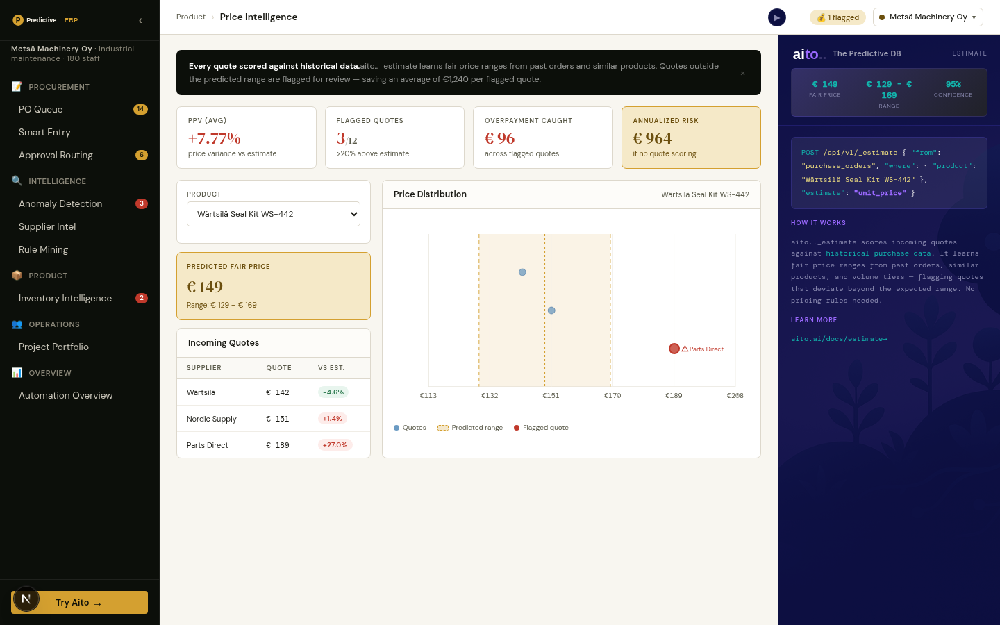

# Price Intelligence — is this quote fair, judged by what came before?



## Overview

Every incoming quote on this page is a real price record dated on or
after the cutoff (`price_quotes`). Each one is scored by `_estimate
unit_price` over `price_reference` — the price history *before* the
cutoff — so the estimate has never seen the quote it judges. A quote
more than 15% above the estimate is flagged for a buyer.

Beside the estimate sits the rule a buyer already has: the median of
what this product cost before. The page shows both on every row.

## The query

```json
POST /api/v2/_estimate
{
  "from": "price_reference",
  "where": { "product_id": "SKU-1239", "supplier": "Berner Oy", "volume": 100 },
  "estimate": "unit_price",
  "select": ["estimate", "why"]
}
```

The date is left out of the `where`: it is what separates the two
tables, and the split is the whole guarantee.

## What it measures

`./do price-eval`, 2026-09-28, engine 2.10.3 (rep2), over every quote on
a product with earlier prices. Error = mean |estimate − list price| /
list price; an overcharge is a quote more than 17% over list.

| Tenant | n | Aito error | Median error | Overcharges caught (Aito / median) |
|---|---|---|---|---|
| Metsä  | 118 | 4.8% | 4.7% | 10 / 10 of 11 |
| Aurora | 843 | 2.2% | 2.1% | 39 / 39 of 39 |
| Studio |  92 | 5.8% | 5.5% | 6 / 6 of 6 |

**Parity, the median slightly ahead.** On this corpus the estimate is
within half a point of the product's own median, not better, and the
view says exactly that.

## What it cannot do here, and why that is stated

A product never bought before has no median — the case where an
estimate from comparable products should earn its keep. Here it does
not: with no earlier rows the estimate falls back on supplier and
volume alone and misses by 46-70%, because `price_reference` carries
nothing about *what* the product is, and `_estimate` on v2 rejects
linked fields (`product_id.category`) that could describe it. So
products with no earlier price are left off the page, and the page
says why, rather than showing a confidently wrong number.

The previous version scored hand-typed "competitor quotes" tuned to
four products and quoted an invented €1,240 saved per flagged quote.
