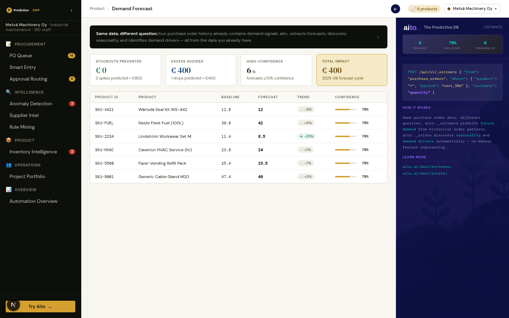

# Demand Forecast — a forecast you can check



## Overview

A buyer already has two forecasts without any database: **same month
last year**, and the **trailing three-month average** a plain ERP
min/max reorder rule uses. A demand forecast is only worth showing if
it is measured against those, on months it has never seen.

This view does exactly that. The last six months of sales are held
out of `monthly_demand`; `_estimate units_sold` forecasts them from the
history before, and every forecast sits next to what actually sold and
next to both rules.

## The query

```json
POST /api/v2/_estimate
{
  "from": "monthly_demand",
  "where": { "sku": "SKU-2983", "season": "autumn", "last_year_band": "270-359" },
  "estimate": "units_sold",
  "select": ["estimate", "why"]
}
```

- **`sku`, `season`** — which product, and when in the year.
- **`last_year_band`** — what this product sold in the same month last
  year, bucketed. Without it `_estimate` weighed every past December
  equally and lost to the seasonal naive rule by 6-9 points wherever a
  product trended. Banded, not raw: Aito matches a raw number in a
  `where` as an exact value no other row shares, while a band is
  evidence it can generalise across (the same reason `quotes.price_band`
  exists).
- **`month` is deliberately absent.** It is unique per product, so it
  names a row instead of describing one.
- `why` lists the history rows the estimate weighted; the view shows
  how many.

## What it measures

`./do demand-eval`, 2026-09-28, engine 2.10.3 (rep2). WAPE = total
|forecast − actual| / total actual units, over the held-out months.

| Tenant | n | Aito | Same month last year | Trailing 3-month rule |
|---|---|---|---|---|
| Metsä  | 282 | **16.8%** | 18.5% | 29.2% |
| Aurora | 300 | 18.8% | **17.7%** | 24.0% |
| Studio | 174 | 20.4% | **17.6%** | 23.9% |

The honest reading: **parity with the seasonal naive rule, and a
quarter to 40% less error than the trailing-average rule** an ERP
reorder point actually runs on. The view computes its sentence from
these numbers and never claims more. The where-shape search stopped at
ten variants on purpose — past that, picking the best is fitting the
holdout.

## The data, and why it is not `orders`

`orders` draws `units_sold` uniformly at random, independent of product
and month, so there was nothing to forecast; the previous version of
this view filled the gap with a rule-of-thumb "confidence" and invented
euro savings. `monthly_demand` is generated by
`data/generate_demand.py` with the structure a real catalogue has, each
piece declared in code: per-category seasonality (winter fuel, spring
DIY, Christmas electronics, the Finnish July catering dip, January
licence renewals), a per-product level and trend, and Poisson noise.
The holdout table is link-free, like `invoice_lines_holdout`.

The products shown are picked from the data on every run — the best
seller of each category over the last twelve months — with the name
read from the same row as the SKU. A hard-coded list went stale when
the catalogue was regenerated: every name pointed at another product.
