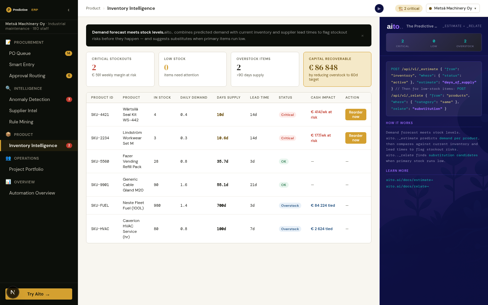

# Inventory Intelligence — will it run out before the next delivery?

## Overview

For the busiest stocked items, the view asks the buyer's question: does
what is on the shelf, plus what is already on its way and lands within
the lead time, cover what will sell before a new order could arrive?

It asks twice — once with Aito's demand forecast, once with the
trailing three-month average a plain ERP min/max rule uses — and then
checks both. The month after the cutoff is held out, so the page shows
which items really did run short and how often each forecast's warning
was right.

## The data

- **`stock`** (synthetic, and labelled so on screen): on hand, on
  order, next delivery, lead time, reorder point. It is simulated by
  `data/generate_demand.py` by playing the product's real sales history
  against a trailing-average min/max rule, so stock is depleted by the
  same demand the forecast learns from rather than typed in.
- **Demand** comes from the Demand Forecast's query — `_estimate
  units_sold` over `monthly_demand` — see
  [09-demand-forecast.md](09-demand-forecast.md).

## What it measures

Two things, both on screen with their counts:

1. **Forecast accuracy against the reorder rule** (`./do demand-eval`):
   Aito's demand forecast has 17-20% error against the trailing rule's
   24-29%. That is the comparison that matters for a reorder point,
   because the trailing rule is what the stock here was managed by.
2. **Were the "will run short" warnings right?** Counted per method:
   warnings raised, how many were right, how many real shortfalls were
   caught. In the held-out month only 0-2 items per tenant actually ran
   short, so the page says plainly that this is too few to separate the
   two methods rather than letting "1 vs 0" read as a result.

The previous version hard-coded stock per SKU, a supplier map, an
invented "€ stockout risk", substitution suggestions and a reorder
button that did nothing.
