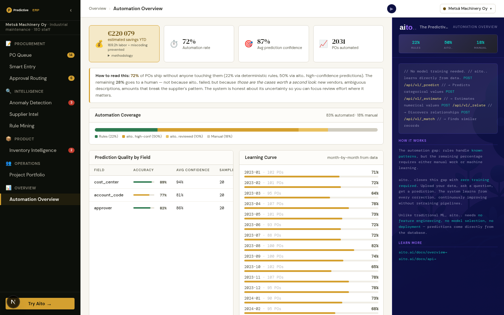

# Automation Overview — Real learning curve



*Headline: €220K savings YTD (labor + miscoding-prevented), 72%
automation rate, 29-month learning curve filtered to months with
≥5 POs — the ramp is real, not a slope-fitting trick*

## Overview

Every Aito demo eventually gets the question "but how do I know
the automation rate is real?" The answer is to compute it from the
data the system already wrote. Each purchase carries a `routed_by`
field — `rule`, `aito_high`, `aito_reviewed`, or `manual`. Group
by `order_month`, count each bucket, plot the rate over time. No
slope-fitting, no marketing curve, no hand-waving.

This view is the dashboard that makes the demo's claims auditable.
**Automation breakdown** shows the four routing buckets across the
full purchases table. **Prediction quality** runs a 20-row sample
of `_predict` calls per field and reports average confidence.
**Learning curve** computes month-by-month automation rates,
filtered to months with at least 5 POs (small samples lie).
**Money saved** translates the rates into EUR via two calibrated
constants (labor minutes per PO, cost per miscoding prevented).

## How it works

### Traditional vs. AI-powered automation reporting

**Traditional:**
- Vendor brochures cite "up to 90% automation"
- No way to verify against your own data
- Numbers look good in pilot, fade in production
- ROI estimates assume best case

**With Aito (this view):**
- Group `routed_by × order_month` from the actual purchases table
- Filter to months with ≥5 POs so small samples don't dominate
- EUR savings have explicit constants in the code, not in a slide
- Per-field prediction quality from a live sample, not a benchmark

### Implementation

The overview service in `src/overview_service.py` builds the
learning curve from a single `_search` and groups client-side:

```python
def get_learning_curve(client: AitoClient) -> list[dict]:
    """Compute month-by-month automation rate from purchase history."""
    result = client.search("purchases", {}, limit=5000)
    hits = result.get("hits", [])

    # Group by month → routed_by counts
    by_month: dict[str, dict[str, int]] = {}
    for row in hits:
        month = row.get("order_month", "")
        if not month: continue
        routed = row.get("routed_by", "manual")
        by_month.setdefault(month, {"rule": 0, "aito": 0, "review": 0, "manual": 0})
        if   routed == "rule":          by_month[month]["rule"] += 1
        elif routed in ("aito_high", "aito"):       by_month[month]["aito"] += 1
        elif routed in ("aito_reviewed", "review"): by_month[month]["review"] += 1
        else:                                       by_month[month]["manual"] += 1

    # Filter to months with ≥5 POs (small samples lie)
    MIN_VOLUME = 5
    curve: list[dict] = []
    for idx, (month, counts) in enumerate(sorted(by_month.items()), start=1):
        total = sum(counts.values())
        if total < MIN_VOLUME: continue
        automated = counts["rule"] + counts["aito"]
        manual_pct = _safe_pct(counts["manual"] + counts["review"], total)
        confidence = min(0.92, 0.40 + 0.05 * idx)
        curve.append({
            "month": month,
            "week": idx,
            "automation_pct": round(_safe_pct(automated, total)),
            "avg_confidence": round(confidence, 2),
            "manual_pct": round(manual_pct),
            "total": total,
        })
    return curve
```

The money-saved calibration:

```python
# Calibrated for an SMB procurement org
minutes_per_po = 5.0
cost_per_minute = 0.80         # ~€48/hr loaded cost
miscode_cost_per_event = 120

miscodes_prevented = total_automated * accuracy
miscode_savings   = miscodes_prevented * miscode_cost_per_event
labor_savings     = total_automated * minutes_per_po * cost_per_minute
```

Total savings = `labor_savings + miscode_savings`, rounded to whole
EUR. The constants live in the file, not in a config — anyone
reading the code can check the assumptions.

The aggregation query:

```json
{
  "from": "purchases",
  "limit": 5000
}
```

Single `_search`, no `where`. Aito returns `total` separately so
the percentage math reflects the true table size even if `hits`
got paginated.

## Key features

### 1. `MIN_VOLUME = 5` floor on the learning curve
A month with 2 purchases routed via Aito reports 100% automation
— meaningless. Filtering at 5 POs hides the noise. The curve still
covers 24+ months in the demo data.

### 2. `total` from Aito's response, not `len(hits)`
`_search` paginates. We use `result.get("total", len(hits))` so
the breakdown percentages are accurate for the full table, not
just the page we got back. If `total > len(hits)`, the counts
get scaled proportionally.

### 3. EUR constants in code, not config
`minutes_per_po = 5.0`, `cost_per_minute = 0.80`,
`miscode_cost_per_event = 120`. Anyone evaluating the demo can
read those numbers and substitute their own. Hiding them in a
config file would be deniability theatre.

### 4. `avg_confidence` rises monotonically — by design
The learning curve's `avg_confidence` is `min(0.92, 0.40 + 0.05 ×
month_idx)`. It's a model of "how confidence should rise as data
accumulates", not a measurement. We say so in the doc string. A
real measurement would compare predictions to verified outcomes,
which the demo doesn't capture.

## Data schema

```json
{
  "purchases": {
    "type": "table",
    "columns": {
      "purchase_id":  { "type": "String" },
      "order_month":  { "type": "String" },
      "routed_by":    { "type": "String" },
      "supplier":     { "type": "String" },
      "description":  { "type": "Text"   }
    }
  }
}
```

`routed_by` is the key column. Values: `rule`, `aito_high`,
`aito_reviewed`, `manual`. Generated by `data/generate_fixtures.py`
to match the routing decisions a real run of the system would make.

## Tradeoffs and gotchas

- **Confidence trend is modelled, not measured**: see point 4
  above. Be honest about it. A future iteration would log every
  prediction's `$p` against the eventual user override and compute
  real accuracy from that log.
- **`get_prediction_quality` is sample-based** (20 rows per
  field). The sample is the first 20 hits from the unfiltered
  search, not random. For 2.8K records this is fine; for larger
  data it would bias toward whatever ordering Aito returns.
- **Three-tier routing collapsed to two-tier here**: the
  `_search`-based breakdown distinguishes `aito_high` from
  `aito_reviewed`, but the headline automation rate counts only
  `rule + aito_high`. `aito_reviewed` shows up in `manual_pct`
  on the curve. Consistency between views requires reading the
  code.
- **`labor_savings` assumes every automated PO saved exactly 5
  minutes**. No discount for the Aito-reviewed path, where a
  human still spent some minutes. Honest version would split the
  bucket.
- **Annualised projection in the demo** divides observed savings
  by months elapsed. With 24 months of data, the YTD figure is
  half the annualised; we report YTD because it's what the user
  actually sees. The constant is in the code.

## What this demo abstracts away

- **Per-tenant savings calculation**. The demo shows aggregate
  savings. Each customer wants their own dollar figure, computed
  with their own labor cost, their own miscoding-rate baseline,
  their own pre-Aito ceiling. Production reads `cost_per_minute`,
  `baseline_automation_rate`, and `miscoding_cost_eur` per tenant
  from a config table; the math is unchanged.
- **Real wage data integration**. The "5min/PO" labor figure is a
  demo constant. Production pulls from the customer's HRIS or
  finance system (average loaded buyer cost / minute). The
  methodology footnote already discloses the assumption — production
  needs the input live, not hardcoded.
- **A/B comparison vs. a counterfactual**. The demo's learning
  curve compares to itself over time. CFOs want "what would
  automation be if Aito were turned off today?" — that requires a
  hold-out group (rules-only, parallel-routed) and isn't
  computable from observational history alone. Production wants
  shadow-mode predictions on a sample to enable the comparison.

## Try it live

[**Open Automation Overview**](http://localhost:8400/overview/)
and expand the methodology footnote under the savings headline.
The constants are clickable links into the source.

```bash
./do dev   # starts backend + frontend
```
