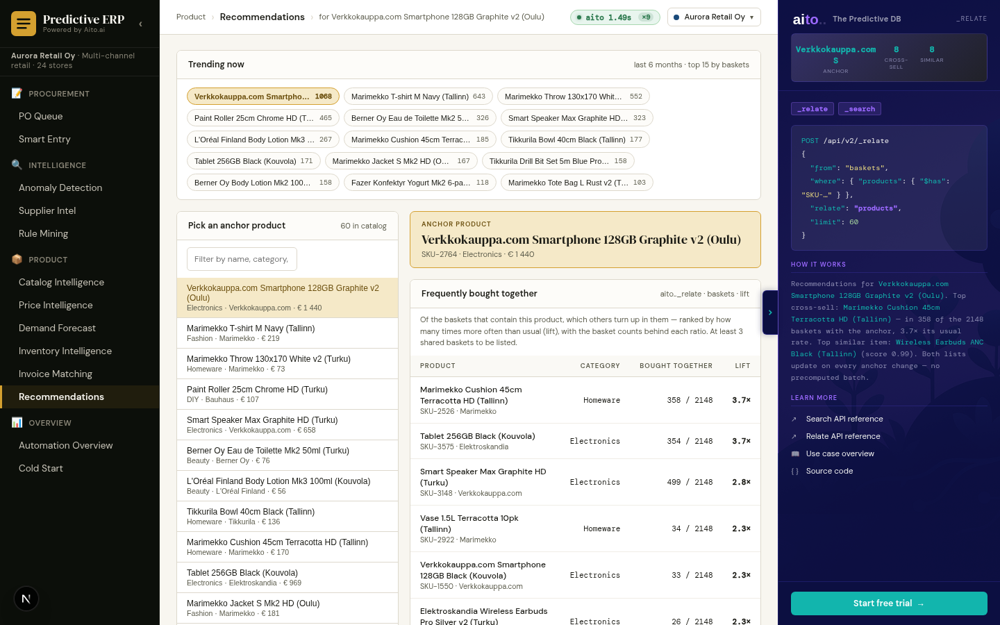

# Use case 14 — Recommendations *(Aurora-only)*

> Cross-sell + similar-products from the same Aito DB. Aito's flagship
> retail capability.



## What it does

For any anchor product, two lists update side by side:

- **Frequently bought together** — products that turn up in baskets
  containing the anchor, ranked by how many times more often than in
  baskets at large (lift), with the basket counts beside each ratio.
  These are *complements* — they grow the basket.
- **Similar products** — same category, scored on supplier and price.
  These are *substitutes* — stockout fallbacks, "see also".

The picker offers the most-bought products, since cross-sell for a
product nobody buys is an empty list. Clicking a result makes it the
new anchor.

## Aito queries

### Bought together: `_relate` over baskets

```json
POST /api/v2/_relate
{
  "from": "baskets",
  "where": { "products": { "$has": "SKU-1003" } },
  "relate": "products",
  "limit": 60
}
```

`baskets.products` is a String[]: the condition is "the basket contains
the anchor", and each other product comes back with its lift and the
counts behind it (`fs.fOnCondition` of `fs.fCondition` baskets). A
product needs at least 3 shared baskets to be listed. On an array field
v2 returns `related` as a feature, `{"$has": "SKU-…"}`; `AitoClient`
unwraps it.

Two earlier versions, and why they went:

- **Goal `_recommend` over `impressions`** ranked products seen once or
  twice anywhere above ones bought with the anchor hundreds of times
  (aito-core#1525).
- **Non-exclusive `_predict products.$feature`** — aito-demo's cart
  pattern — answers "how likely is X in this basket", so the store's
  best-sellers topped every anchor's list.

### Similar products: `_search`, scored by a rule

```json
POST /api/v2/_search
{ "from": "products", "where": { "category": "Beauty" }, "limit": 40 }
```

Scored in the service: 0.5 same category, +0.3 same supplier, +0.2 ×
price closeness. A hand-weighted rule, and the page labels it as one.

## What it measures

`./do crosssell-eval` asks how many of each anchor's known companions
(the generator gives every product three) reach the top 8:

| anchors | the view | counting co-occurrences |
|---|---|---|
| well-bought (20+ baskets) | 55 / 90 | 57 / 90 |
| rarely-bought (3–8 baskets) | 1 / 90 | 18 / 90 |

Parity where history is thick. On rarely-bought products the support
floor lists few rows rather than guessing, and plain counting finds
more. The view claims nothing better than parity.

## Tradeoffs / honest notes

- **Aurora-only**: only Aurora has `baskets`; the view is hidden on
  Metsä and Studio.

## Why retail buyers care

Recommendations are the Aito capability with the most direct revenue
attribution: cross-sell drives basket size, similar-products covers
stockouts. Aito's grocery demo (demo.aito.ai) leans on this. A retail
prospect reading the Predictive ERP demo without a recommendations
view notices the gap.

## Implementation

[`src/recommendation_service.py`](../../src/recommendation_service.py)
— `get_overview()` (catalogue + trending), `get_cross_sell()`
(co-occurrence aggregation), `get_similar()` (attribute scoring).
Each result type degrades gracefully to `[]` when the underlying
table isn't loaded for the active tenant.

## What this demo abstracts away

- **Real-time inventory awareness**. The demo recommends from the
  full catalogue. Production filters out-of-stock SKUs at query
  time (or surfaces a "back in stock 12 May" note); recommending a
  product that can't be ordered erodes user trust fast. Easy
  addition: `where: { ..., stock_units: { "$gt": 0 } }`.
- **Customer-segment personalization**. The demo's anchor →
  cross-sell is the same for every viewer. Real recommenders take
  customer segment (loyalty tier, geography, lifetime spend) into
  the `where` clause. Aito supports it directly; the demo doesn't
  model the customer table.
- **A/B test framework for recommendation quality**. Real
  retailers measure recommendation impact by holding out a
  control group that sees nothing or sees random products.
  Production wants `(recommendation_id, shown_to, clicked,
  purchased)` tracking + weekly lift reports. The demo shows the
  recommendations; it doesn't measure whether they convert.
