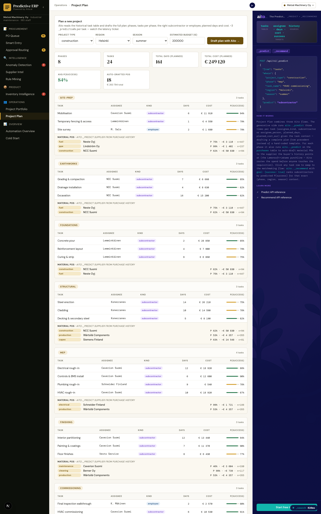

# Project Plan — Generative planning + subcontractor matchmaking + auto-PO drafts



*A 24-task construction plan drafted from four input fields. Phases,
tasks per phase, the right subcontractor or employee, planned days
and cost, plus per-phase auto-drafted material POs — every cell
comes from history via Aito.*

## Overview

The Project Plan view is Metsä's "what an ERP becomes when predictions
are native" answer. A user provides four pieces of context — project
type, region, season, rough budget — and Aito drafts the entire plan.
Then every cell is editable, with Aito available at any click for
alternatives.

Three Aito flows compose on one page:

1. **Generative drafting.** From four fields, propose phases → tasks
   per phase → assignee per task → planned days → planned cost.
   ~140 `_predict` calls fan out in parallel; the latency badge in
   the topbar lights up with the real numbers.
2. **Subcontractor matchmaking.** Click any task → `_recommend
   goal: {success: true}` ranks subcontractors by predicted P(success)
   for that exact (phase, project_type, region, season) slice. The
   top of the list is who the buyer's history says wins.
3. **Auto-PO drafts.** Per phase, Aito predicts the typical purchase
   categories (curated mapping) and which supplier each category
   routes to (`_predict from=purchases predict=supplier`). The
   Lemonsoft + Jakamo punchline: when Aito drafts a project, it
   doesn't just propose phases and subs — it pre-fills the
   supplier-side spend before anyone touches the requisition.

## How it works

### The data shape

| Table | What's in it |
|---|---|
| `projects` | One row per project: project_type, manager, customer, budget, duration |
| `tasks` *(new)* | Phase, task_name (Text), assignee_kind, subcontractor or assignee_person, planned/actual days+cost, region, season, success/on_time/on_budget |
| `purchases` | Existing PO history: supplier, category, amount_eur — drives the auto-PO layer |

The `tasks` table is the new one. `task_name` is `Text` so the full-plan
generator can compose typical names from history; `phase` is `String`
so `_predict phase` returns whole phase values. `subcontractor` and
`assignee_person` are nullable — exactly one is set per task,
discriminated by `assignee_kind`.

### Engineered signal in the fixture

Aito only surfaces what the data actually carries. `data/generate_personas.py`
hand-tunes Metsä's task fixture so the demo's queries return
meaningful rankings:

| Phase | Best | Next | Wildcard |
|---|---|---|---|
| earthworks | **NCC** 86% (n=88) | Lemminkäinen 71% | YIT 60% (n=5) |
| foundations | **Lemminkäinen** 84% (n=80) | NCC 75% | YIT 25% (n=4) |
| structural | **NCC** 90% (n=58) | Lemminkäinen 85% | Konecranes 74% |
| mep | **Caverion** 90% (n=71) | YIT 91% | Schneider 68%, Lemminkäinen 50% |
| commissioning | **Caverion** 94% (n=49) | YIT 78% | — |
| repair | **Caverion** 89% (n=57) | Vesto 86% | YIT 82% |

Plus region affinity (Caverion is strong in Helsinki, weaker in Oulu),
season effects (concrete pour drags 18pp in winter), and project-size
effects (Lemminkäinen drags below €80k subcontracts). These patterns
are what `_predict` and `_recommend` learn — no hard-coding in the
service layer.

### Two modes — full draft and step-by-step editor

**Draft full plan** runs the entire fan-out in one go: ~140 calls in
parallel via `ThreadPoolExecutor`, with `contextvars.copy_context()`
per submitted task so the per-request timing bucket reaches every
worker (otherwise the latency badge would only see the main-thread
calls).

**Build step-by-step** is the interactive walker. The user picks each
phase from candidates, accepts each task with a swap-able assignee,
and Aito runs fresh `_predict`s at every click. Once the plan is
built, every accepted task becomes a row in an editable table:
- Click the assignee chip → top-3 alternatives surface inline
- Edit days/cost in place
- × deletes the row
- "+ Add task in <phase>" reopens the candidate picker for that phase
- "+ Add phase" extends the plan

### Query patterns

```python
# Generative — phase × task × assignee fan-out
_search  from=tasks where={project_type, status: complete}    # discover phases + typical task names
_predict from=tasks where={project_type, phase, region, season} predict=assignee_kind
_predict from=tasks where={project_type, phase, region, season, assignee_kind} predict=subcontractor
_predict from=tasks where={...same, subcontractor} predict=success    # P(success) per chosen vendor

# Matchmaking
_recommend from=tasks
           where={phase, project_type, region, season, assignee_kind: subcontractor}
           recommend=subcontractor
           goal={success: true}

# Auto-PO drafts (per phase)
_predict from=purchases where={category} predict=supplier
_search  from=purchases where={category, supplier}    # historical typical amount
```

## Tradeoffs and gotchas

- **`task_name` as Text.** The full-plan generator uses `_search` +
  Counter for task names rather than `_predict task_name` because
  Text fields tokenise — predicting on them returns token-level hits
  ("HVAC" alone) rather than whole names. The step-by-step walker
  uses the same approach for the same reason.
- **`phase` as String.** Whole-phase predictions, no tokenisation.
- **Phase ordering.** Aito's `_predict phase` ranks by raw frequency
  (so MEP wins on row count), but the walker UI sorts candidates by
  a curated `PHASE_ORDER` list with `-P` as the tiebreaker. The
  user is building a plan in execution order — chronology beats
  frequency for that UX.
- **Sum-of-parallel-calls in latency.** A 24-task plan reports
  ~220s of total Aito work in `X-Aito-Calls`, but the wall-clock
  request takes ~3 seconds because the calls fan out in parallel.
  The badge shows the sum (matching accounting-demo's pattern); the
  user can see ×N count to interpret it correctly.

## Lemonsoft + Jakamo positioning

The view is shaped around the post-acquisition story:

- **Lemonsoft** runs your purchase orders, approval, ledger.
- **Jakamo** runs the supplier portal — collaboration, schedules,
  certificates, deliveries.
- **Aito** reads both — and on day zero of a new project, drafts the
  plan: phases, tasks, who should do each one, how long they'll take,
  what they'll cost, plus the material POs that flow back to the
  Jakamo side. All from the history that's already in your system.

## Code

- Page: [`frontend/app/project-plan/page.tsx`](../../frontend/app/project-plan/page.tsx)
- Service: [`src/task_service.py`](../../src/task_service.py)
- Schema: [`src/data_loader.py`](../../src/data_loader.py) (`tasks` table)
- Fixture generator: [`data/generate_personas.py`](../../data/generate_personas.py)
  (`generate_metsa_tasks`)
- Endpoints: `POST /api/project-plan/generate`, `/rerank`,
  `/next-phase`, `/next-tasks`, `/next-assignee`,
  `/phase-purchases` in [`src/app.py`](../../src/app.py)
