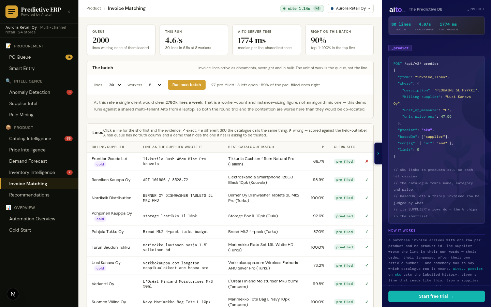

# Use case 17 — Invoice Matching *(Aurora-only)*

> A supplier's invoice lines matched to catalogue SKUs. One `_predict`
> on a link, run as a batch. The most universally requested case on the
> prospect list.



## What it does

A purchase invoice arrives with one row per product and no product id.
The supplier wrote each line their own way — their word order, their
language, often their own article number — and somebody has to say
which catalogue row it means. At 3200 SKUs that is a search, and it is
the single most requested thing on our prospect list.

It is one query. `sku` is a link into `products`, so a single
`_predict` ranks catalogue **rows** and returns their columns — which
is what lets the shortlist argue for itself instead of showing five
bare identifiers.

The view runs the queue at N workers and puts throughput on screen,
because the constraint on this shape of work is rows per hour, not the
latency of any one line.

## Aito query

```json
POST /api/v2/_predict
{
  "from": "invoice_lines",
  "where": {
    "description": "PESUAINE 5L PYYKKI",
    "billing_supplier": "Uusi Kanava Oy",
    "unit_of_measure": "L",
    "unit_price_eur": 47.55
  },
  "predict": "sku",
  "basedOn": ["supplier"],
  "config": { "ai": "and" },
  "limit": 5
}
```

Three arguments earn their place, and each was measured rather than
assumed.

**`predict: "sku"` is a link.** Each hit carries the catalogue row's
own name, category and price, so the shortlist can show what it is
recommending. Note the projection gotcha: with no `select`, Aito
returns the whole linked row by default, and the moment you name a
`select` — which this client must, for `$why` — that default is
replaced. Linked columns have to be named explicitly. That is what
`AitoClient.predict(select_extra=…)` is for.

**`config.ai = "and"`** is set rather than inherited. rep1 defaults to
And-only and rep2 to Group re-expression, so a v1/v2 comparison with no
`config.ai` compares two *presets* as much as two engines — which is
how a six-point "rep2 is behind" reading survived several rounds of
measurement here. Setting it explicitly is worth 2.2 points and 25%
lower latency on rep2.

**`basedOn: ["supplier"]` is rep2-only, and that is measured.** It lets
a thinly-invoiced catalogue row be judged by what rows from its
supplier do, and report which attribute carried it. On rep1 the same
argument costs ten points overall and twenty on cold start — the
opposite sign — so `rank_line` branches on `client.api_version`, the
one engine branch in these services, and a test fails if that stops
being true.

## Reading the shortlist

Chips carry provenance, and the difference is the lesson:

- **teal** — Aito's `$why` named this as evidence
- **red** — Aito weighed it *against* the row
- **gold** — computed here (unit matches, price within N% of list); the
  database never argued it
- **dashed `↳ via …`** — a **prior**: Aito could not judge the factor
  from this row's own history and generalised across rows sharing its
  supplier. A generalisation, not something it has seen, so it is drawn
  as the weaker claim it is.

The chips render the **proposition**, not the highlights. `highlight`
marks only some members of a group and sometimes none, so a display
built on the markers showed `{TV, ea, 55"}` as "unit of measure ea" and
a five-column vendor group as one supplier name — the factor was on
screen and most of its content was not.

## Measurement came before the view

`./do match-eval` scores 2000 held-out lines that were never loaded,
and it existed before the view did. The other order is how a demo ships
a confident number nobody has checked.

Current figures (rep2, engine 2.8.4, corpus rev 3):

| | top-1 | top-5 |
|---|---|---|
| overall | **90.0%** | 97.7% |
| supplier seen before | 89.9% | 97.3% |
| supplier never seen | 90.4% | 98.4% |
| *ceiling* — a perfect name matcher | 100% | 100% |
| *floor* — TF-IDF over product names | 58.2% | 83.8% |

The ceiling and floor are the point. 90% means nothing next to 100%
and everything next to a 58% text index — and if the text index won,
the database would not be earning its place in the pipeline.

**The mix is published, not chosen.** Bucketed by how much of the
catalogue name survives into the line:

| overlap | share | Aito | TF-IDF |
|---|---|---|---|
| 0% | 3.8% | 85.3% | 0.0% |
| 1-33% | 0.9% | 78.9% | 0.0% |
| 34-66% | 25.6% | 91.4% | 28.6% |
| 67-99% | 38.6% | 91.1% | 56.6% |
| 100% | 31.1% | 88.6% | 93.4% |

A 100%-overlap line is a **lookup**, and a text index should win it —
it does, 93.4% to 88.6%. The rows above it are where history is the
only route to an answer, and there the text index scores zero. A single
blended number averages the task Aito is not needed for against the
task it exists for. Never reweight the mix until the database wins;
publish the shares and report per regime.

## Nothing posts unattended, and the measurement is why

The obvious demo is an auto-post threshold. The coverage/precision
table says where that bar sits: tightened to p ≥ 0.50 the top pick is
right 93.5% of the time and covers 92.5% of lines. That is a real bar,
and it is still a human's decision to set it — `PRESELECT_THRESHOLD`
decides only whether the top row arrives pre-filled or open, and both
end in front of a clerk. The table is on screen so a reader picks their
own bar, and a test fails if the threshold stops matching a measured
row.

The claim is the smaller, real one: **the search goes away.** A clerk
gets five ranked rows with the evidence attached instead of hunting
3200 SKUs.

## The held-out label is on screen

A production queue has no truth column. A demo that has one and hides
it is asking to be trusted, and the ✗ rows are the honest half of the
pitch.

## Schema

`invoice_lines` (120 000 rows, loaded) and `invoice_lines_holdout`
(2000, never loaded) are generated together and only one is uploaded.

The holdout table is deliberately **link-free**. `invoice_lines.sku`
links to `products` and `billing_supplier` to `vendors`; giving the
holdout the same links would let rows Aito is supposed to have never
seen feed `_predict` through those shared tables, and accuracy would go
*up* — the worst possible symptom, because it reads as progress.
`test_the_holdout_table_carries_no_links` fails if a link appears.

## What makes the corpus answerable

A clerk doing this by hand is not guessing: the invoice, the vendor
master and the catalogue between them identify exactly one row. Three
routes in, and every line has at least one.

1. **The words** — exact, a synonym, or the other language.
   `rose` → `Ruusu`. Half the vendors write in Finnish, because
   cross-language is the case a text index cannot answer at all.
2. **The vendor** — `vendors` carries a city and a market position that
   map onto product `origin` and `grade`, reached through a *linked*
   clause (`billing_supplier.sells_origin`), so a vendor invoicing for
   the first time still inherits "a wholesaler in Turku sells rows like
   these". When a vendor sells off its usual profile the line names the
   origin, so the information never simply vanishes.
3. **The description** — `products.description` carries the sizes a row
   covers in words *and* figures ("8m tai pitkä"), so a line quoting
   `40cm` reaches a row called `Pitkä` through that and nothing else.

`./do booktest-matching` guards all of it: offline tests assert the
properties that make the case answerable, and live tests score the
held-out half against the claims the view makes. Every one of those
offline tests is a mistake this corpus actually shipped with, and none
looked like a bug from the outside — they all looked like a mediocre
database.

## Tradeoffs / honest notes

- **The catalogue is 3200 SKUs, not 20 000.** A real catalogue of that
  size is a harder problem and the difference gets stated rather than
  glossed.
- **The data is generic retail goods.** The case this was drawn from is
  a flower wholesaler with no NDA in place and unconfirmed volumes, so
  nothing here is modelled on it. Generic transfers to every other
  line-matching prospect anyway.
- **Cold start reads at parity with warm, and that is a corpus design
  choice.** Every cold vendor has a warm twin on (origin, grade,
  style), because a vendor whose style *and* profile are both
  unprecedented is unanswerable rather than hard — `abbreviate` on a
  single cold vendor scored 28.7% for exactly that reason. So "a
  familiar vendor is easier" is not a claim this corpus supports. A
  genuinely unprecedented supplier would be harder, and measuring that
  needs a cold vendor with no twin, reported on its own line.
- **Throughput is a sizing figure, not an algorithmic one.** ~3 rows/s
  at 8 workers against a shared multi-tenant Aito from a laptop.
  Throughput saturates past four workers — beyond that, latency grows
  in step with the worker count, which is a queue, not parallelism.
  More workers is not the lever; instance sizing is.
- **A number here has a build attached to it.** rep2 scored 16.8%
  against rep1's 26.8% on core `38a234a6` and that was filed as core
  #1281; the `nameBoost` work in 2.8.0 reversed it. `./do v2-check`
  proves query *shape*, not accuracy, and reported all views green
  throughout.

## Implementation

- `src/matching_service.py` — `rank_line`, the batch runner, the
  provenance chips, `MEASURED_BY_ENGINE`
- `src/match_eval.py` — `./do match-eval`, the held-out scoring
- `src/match_baseline.py` — the ceiling and the TF-IDF floor
- `data/generate_invoice_lines.py` — the corpus, the vendor roster and
  the rendering styles
- `tests/test_matching_booktest.py` — the invariants and the live
  backtest
- `frontend/app/matching/page.tsx` — the queue, the shortlist, the
  measured table

## What this demo abstracts away

- **Multi-line invoice context.** Each line is matched independently.
  A real invoice is a document, and the other lines on it are evidence
  — a line that is ambiguous alone is often obvious next to the five
  around it. Aito supports it (put the invoice's other SKUs in the
  `where`); the demo does not model it.
- **A feedback loop.** A clerk correcting a match is the most valuable
  training row there is, and in production it goes straight back into
  `invoice_lines`. The demo scores a fixed held-out split instead,
  because a demo that learns from its own audience cannot be measured.
- **Fuzzy quantity and unit reconciliation.** "6-pack" invoiced as 6
  units against a catalogue row priced per pack is a real and separate
  problem. The demo checks unit equality and price drift and shows both
  as computed facts, not predictions.
