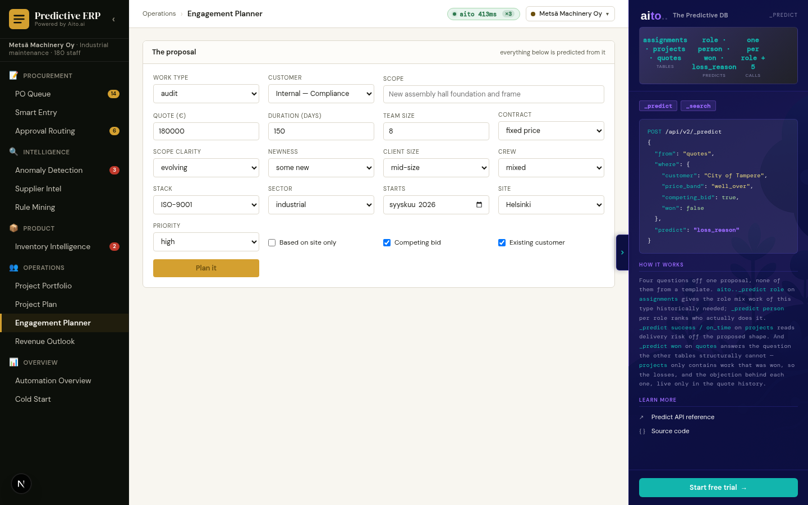

# Use case 18 — Engagement Planner *(Metsä + Vire)*

> A proposal in; a staffed team, a price check, delivery risk and a
> predicted customer objection out. `_predict` × N over four tables.



## What it does

Fill in a proposal — customer, scope, quote, duration, team size, site
— and the planner answers the four questions a delivery lead actually
has: **who staffs it**, **is the price right**, **what will go wrong**,
and **why might we lose it**.

It is split into **Bid** and **Delivery** tabs, because two jobs on one
screen were crowding each other: the objection ranking is a sales
artefact and the capacity table is a delivery one.

## Aito queries

### The role mix, and why it is capped

```json
POST /api/v2/_predict
{
  "from": "assignments",
  "where": { "project_type": "implementation", "site": "Tampere" },
  "predict": "role",
  "limit": 12
}
```

`_predict role` returns a **share**, and scaling a share to a big team
asks for two project managers on eight people. `_role_caps` reads the
most of each role that ever appeared on ONE project, so a singleton
stays a singleton — without anyone hard-coding which roles are
management.

The role vocabulary is **disciplines** (`frontend`, `ux design`, `site
manager`), not seniority bands.

### The people, per role

```json
POST /api/v2/_predict
{
  "from": "assignments",
  "where": {
    "role": "frontend",
    "project_type": "implementation",
    "person.site": "Tampere",
    "person.skills": { "$has": "React" }
  },
  "predict": "person",
  "limit": 10
}
```

`assignments.person` links to `people`, so one call returns the ranking
**and** the matched person's title, skills, site and seniority — which
is what the match chips show.

**Two kinds of clause, and the difference is the lesson.**
`project_type` / `role` / `site` describe the JOB and are *evidence*.
The `person.*` clauses are linked-field *filters* on the candidate, and
Aito applies them in the query, so a filtered-out person never reaches
the shortlist. Requirements are held **per role** — a proposal-wide
"must have Next.js" staffed the QA and project-manager seats with
frontend developers, because the filter is enforced while `role` is
only weighed.

### Delivery risk — six calls, six `$why` trees

Futurice's 3+3, not time-and-budget. The core three — makes money,
team stays happy, customer stays happy — decide whether an engagement
was worth doing; the qualifying three are predictability, whether the
thing worked, and whether it opened a door.

Six separate `_predict` calls, because a schedule risk and a morale
risk have different drivers. `success` is a composite of the core
three, so "on time and on budget while burning the team and losing the
account" scores as the failure it is.

### The sales read

```json
POST /api/v2/_predict
{ "from": "quotes",
  "where": { "customer_size": "small", "price_band": "well over" },
  "predict": "loss_reason" }
```

`projects` records work that was **won**. Nothing else in the schema
can answer "will this land, and if not what will they say", because
every row in every other table is a survivor. `quotes` carries the
losses and a nullable `loss_reason`.

`price_band` is bucketed on purpose: Aito reads "we quoted well over"
far more reliably than a raw Decimal it has never seen, and the bucket
is what a salesperson argues about anyway.

## The two candidate columns, and two questions

| column | query | question |
|---|---|---|
| **Usual pick** | `P(person \| role, site, stack, sector)` | who *does* this work |
| **Did well** | `_predict went_well` with the person in the `where` | who did well when they did |

They diverge, and the gap is the conversation: the second most usual
project manager scores 16% usual and 28% did-well.
`assignments.went_well` is deliberately not a restatement of
`project_success` — a good person on a doomed project still did their
bit.

**The candidate number is not a quality score.** The column says "Usual
pick" and the picker says so in words, because "Fit 43%" invited the
reading that Aito rates how well someone does their job. It does not,
and a demo that implies it would be selling something the database
cannot do.

An earlier version asked `_recommend … goal={went_well: true}` once per
role — cheaper, and nearly useless: 0.73-0.83 across every candidate
while the underlying per-person rates run 10% to 87%. Goal-ranking
smooths across the candidate set; asking about one person at a time
does not, so the shortlist is fanned out.

## Levers answer "so what"

Six probabilities describe a risk; none says what to do about it.
`_levers` re-runs the same outcome `_predict` against a context that
differs in one field — three weeks longer, one fewer person, one more —
and reports the delta.

> "Three weeks buys 17 points of on-time and costs 26 of margin"

is a decision. "On-time is 51%" is a fact. No new query shape, just the
same question asked about a slightly different project.

On a fixed-price, unclear-scope, new-stack, small-client proposal the
planner reports money at 16% and team happiness at 76%, and says
nailing the scope buys +29 points of on-time while three more weeks
buys nothing — because the problem was never duration.

## Schema

Five tables earn their place by answering something nothing else can:

- **`people`** — discipline, title, skills, site. `assignments` records
  who worked on what; it cannot say *why* they were the right choice.
  `skills` is a `String[]`, not prose: `{"skills": {"$has": "UI
  design"}}` matches people who have that skill, not everyone with the
  word "design" in a sentence. It was Text once, whitespace-joined,
  which shredded every multi-word skill into fragments and made
  "management" appear three times in one person's list.
- **`assignments`** — project × person × role, with `project_type` and
  `project_success` denormalised for direct filters.
- **`absences`** — planned leave. An empty calendar and parental leave
  look identical from `assignments`, and only one means the person is
  available.
- **`proposals`** — provisional teams for bids that have not closed.
  Counted **separately**, never folded into booked load: treating a
  40%-likely bid as booked time makes everyone look busy, while
  ignoring it lets three leads each plan the same person. It surfaces
  as "2 bids want them" and breaks ties.
- **`quotes`** — the losses, with `loss_reason`.

## Availability is a window, not a number

`assignments` carries the months each booking occupies and `absences`
carries planned leave; `availability_service` combines them into
per-person load across the *project's own* months. The same proposal
starting in September and in March staffs differently — the best
frontend fit is on annual leave in December.

This is plain aggregation, not prediction. A calendar is a fact, and
dressing arithmetic up as inference is the sort of thing this demo must
not teach.

**Seats are phased.** A designer is wanted at the start and a QA
engineer at the end, so each seat books only the months its role
historically occupies and availability is asked about those months. The
phases are measured from `assignments` × `projects` rather than
declared in the service — a constant copied across that boundary would
drift.

## Tradeoffs / honest notes

- **Where Aito stops.** Aito ranks candidates per role; it does not
  allocate a team. "Who fits this role" is an inference; "who gets
  which seat given everyone else's" is an assignment problem, and
  pretending the second falls out of the first books one person into
  three roles. `_fill_seats` is a deliberate, documented greedy pass
  over Aito's ranking (no double-booking, skip the overloaded) and
  every seat stays overridable.
- **The prediction is only as good as the correlation in the fixture.**
  `assignments.role` used to be drawn uniformly across every
  discipline, which staffed a *design* project with backend developers
  and made `_predict role` return the same near-flat mix for every
  service line — because that is genuinely what the data said. Each
  project type now declares the disciplines it uses. If the planner
  proposes an incoherent team again, this is the first place to look.
- **Asking for eight seats where comparable work used three** spreads
  the long tail of the mix onto the team. The mix is right, the size is
  not, and the form says so in red rather than silently producing a
  strange team.
- **The role list is editable.** ± seats per role, `+ add role`, a
  per-seat requirement, `reset to predicted mix`. The prediction is a
  starting point, not a verdict.

## Implementation

- `src/planner_service.py` — role mix, people per role, delivery risk,
  the sales read, `_fill_seats`, `_levers`
- `src/availability_service.py` — bookings × absences over the
  project's months
- `frontend/app/planner/page.tsx` — Bid / Delivery tabs, seat pickers
- `tests/test_planner_service.py`

## What this demo abstracts away

- **Cost and margin per person.** The planner reasons about fit and
  availability, not rate cards. A real staffing decision trades a
  senior's rate against a junior's ramp-up, and that arithmetic is a
  finance system's, not a prediction.
- **Consent.** People are not interchangeable and a plan that ignores
  what someone wants to work on is a plan they will leave over. Real
  scheduling is a negotiation; the demo produces the opening position.
- **Partial allocation across overlapping projects.** Load is modelled
  per month, not per week, so two half-time bookings that collide
  inside a month look fine here.
