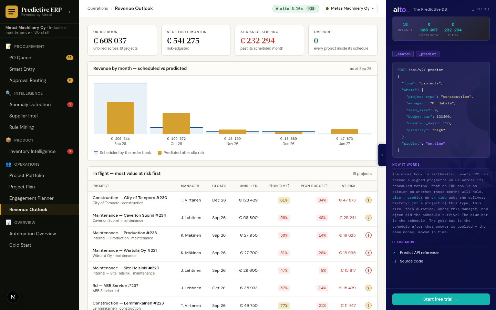

# Use case 19 — Revenue Outlook *(Metsä + Vire)*

> The order book spread over the coming months by percentage-of-
> completion, then risk-adjusted by `_predict on_time` / `on_budget`
> per in-flight project.



## What it does

Answers the question a CFO asks at the end of every quarter: **when
does sold work turn into cash, and how much of that date do we
believe?**

Two halves, and the split is the point:

1. **Arithmetic** — the order book spread over the months each project
   occupies, by percentage-of-completion. Contract value, elapsed
   share, recognised revenue. No prediction anywhere.
2. **Inference** — `_predict on_time` and `_predict on_budget` per
   in-flight project, used to risk-adjust the arithmetic.

A spreadsheet does the first half. The second is what a predictive
database adds, and keeping them visibly separate is deliberate: a
schedule is a fact and a slip is a forecast, and a demo that blends
them teaches the wrong lesson.

## Aito queries

```json
POST /api/v2/_predict
{
  "from": "projects",
  "where": {
    "project_type": "maintenance",
    "contract_type": "fixed price",
    "scope_clarity": "unclear",
    "team_seniority": "mixed",
    "customer_size": "small"
  },
  "predict": "on_time",
  "limit": 2
}
```

Two calls per in-flight project — `on_time` and `on_budget` — because
they answer different questions and diverge. A project can be late and
profitable, or on time and underwater, and a single "risk" score
averages exactly that away.

`_predict_true_p` pulls the probability of `true` out of the
distribution along with its `$why`, so every adjusted month can be
opened and argued with.

## How the risk adjustment works

For each in-flight project:

- `_month_span(duration_days)` gives the months it occupies
- percentage-of-completion spreads contract value across them
- `p(on_time)` shifts revenue **later** — a project unlikely to finish
  on schedule recognises less this month and more next
- `p(on_budget)` scales the **amount** — a project unlikely to hold
  budget recognises less than its contract value implies

The result is two lines on the same chart: **booked** (what the order
book says) and **risk-adjusted** (what the history says about projects
that look like these). The gap between them is the conversation.

## The outcome drivers, and why there are five

From a real software-project post-mortem. They earn their place
because their effects **diverge** — a single success score averages
that away.

| driver | what it does |
|---|---|
| `contract_type` × `scope_clarity` | fixed price on an unclear scope: money 33% vs 71% on a clear one |
| `novelty` | a new stack: money **38%**, team **90%** |
| `team_seniority` | the one factor that moves everything the same way (71/89/73 vs 44/63/52) |
| `customer_size` | small clients: customer-happy 48% vs 59%, doors opened 11% vs 26% |

`team_seniority` is derived from who is actually on the crew rather
than drawn separately, so "senior team → everything goes better" is a
relationship between two columns and not two independent dice.

## Schema

- **`projects`** — contract value, start date, duration, the five
  drivers, and the outcome columns (`on_time`, `on_budget`,
  `success`). One row per project.
- **`assignments`** — used only to derive `team_seniority`; the
  forecast itself is project-level.

Aurora hides this view along with `/projects`: a retailer's order book
is not project-shaped, and showing it there would be selling a fit that
does not exist.

## Tradeoffs / honest notes

- **Percentage-of-completion is a choice, not a truth.** Real revenue
  recognition depends on the contract — milestone billing, time and
  materials, and fixed price all recognise differently, and a real
  finance team will have opinions. The demo uses straight-line PoC
  because it is the most legible, and says so on screen.
- **The prediction is about projects that look like this one**, not
  about this one. A project with no comparable history gets a
  near-base-rate answer, which is the honest output and looks
  unimpressive. That is the correct behaviour.
- **Only in-flight projects are adjusted.** Completed work is a fact
  and future work that has not started is a sales forecast, which is a
  different question with a different table behind it (`quotes`).
- **Month granularity.** A project ending on the 3rd and one ending on
  the 28th recognise identically here.

## Implementation

- `src/forecast_service.py` — `_predict_true_p`, `_outlook_for`,
  `_build_timeline`, `get_outlook`
- `frontend/app/forecast/page.tsx` — the two-line chart, the per-project
  table, the `$why` drill-down
- `tests/test_forecast_service.py`

## What this demo abstracts away

- **Cash vs revenue.** Recognised revenue is not money in the bank.
  Payment terms, invoicing lag and collections sit between them, and a
  CFO cares about all three. The demo forecasts recognition.
- **Cost.** Revenue without cost is not margin. The drivers predict
  `on_budget` as a boolean rather than a euro overrun, because the
  fixture has no cost ledger to overrun against.
- **Portfolio correlation.** Projects are predicted independently. In
  reality the same three people are on four of them, so their slips
  correlate — which is exactly what makes a portfolio forecast
  optimistic. Modelling that needs the staffing graph the Engagement
  Planner already has, and joining the two is a real follow-up.
